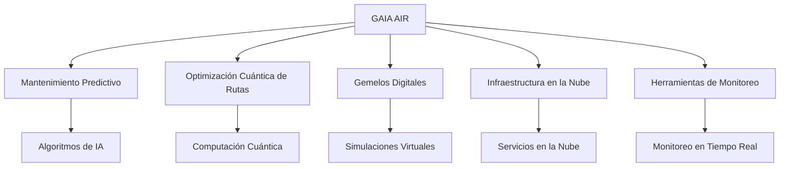

## GAIA
### General Artificial Intelligence Architecture

#### Resumen Ejecutivo
**GAIA** es una plataforma tecnológica integral que aborda desafíos críticos en los sectores de aviación, exploración espacial y tecnología verde. Al combinar inteligencia artificial, blockchain, computación cuántica y servicios en la nube, GAIA proporciona soluciones innovadoras para mejorar la eficiencia operativa, promover la sostenibilidad y garantizar la seguridad en diversas industrias.

### Índice de Contenidos

- Introducción
- Proyectos
  - GAIA AIR
  - GAIA SPACE
  - GAIA GREENTECH
- Estructura del Proyecto
- Guía de Instalación
- Uso
- Documentación
- Contribución
- Licencia
- Contacto

### Introducción

GAIA es un ecosistema de soluciones multidisciplinarias diseñado para enfrentar y resolver problemas complejos en diferentes sectores. Al integrar tecnologías emergentes y enfoques innovadores, GAIA busca:
- Mejorar la eficiencia operativa mediante la automatización y optimización de procesos.
- Promover la sostenibilidad a través de la gestión inteligente de recursos y la reducción de emisiones.
- Garantizar la seguridad implementando sistemas avanzados de monitoreo y protección de datos.

### Proyectos

#### GAIA AIR

**Soluciones para la industria aeronáutica:**
- **Mantenimiento Predictivo:** Utiliza algoritmos de IA para predecir y prevenir fallos en aeronaves.
- **Optimización Cuántica de Rutas:** Aplica computación cuántica para determinar rutas de vuelo óptimas.
- **Integración de Blockchain:** Asegura la integridad y transparencia en la gestión de datos de vuelo.
- **Gemelos Digitales:** Crea simulaciones virtuales de aeronaves para pruebas y desarrollo.
- **Infraestructura en la Nube:** Ofrece servicios escalables y seguros para operaciones aéreas.
- **Herramientas de Monitoreo:** Proporciona monitoreo en tiempo real de sistemas y operaciones.

#### GAIA SPACE

**Herramientas para la exploración y gestión espacial:**
- **Gestión de Flotas Satelitales:** Monitorea y controla satélites y naves espaciales.
- **Optimización Orbital:** Calcula trayectorias óptimas para misiones espaciales.
- **Monitoreo de Activos Espaciales:** Supervisa el estado de equipos y sistemas en el espacio utilizando IA.
- **Comunicaciones Seguras:** Establece enlaces de comunicación protegidos entre la Tierra y el espacio.
- **Operaciones de Lanzamiento:** Simula y gestiona operaciones de lanzamiento de cohetes.
- **Servicios en la Nube:** Proporciona infraestructura para operaciones y análisis de datos espaciales.

#### GAIA GREENTECH

**Soluciones sostenibles para el medio ambiente:**
- **Gestión de Energías Renovables:** Optimiza la producción y distribución de energía limpia.
- **Redes Eléctricas Inteligentes:** Mejora la eficiencia y resiliencia de las redes eléctricas.
- **Monitoreo Ambiental:** Supervisa variables ambientales clave mediante sensores y IA.
- **Gestión de Recursos:** Promueve el uso eficiente y sostenible de recursos naturales.
- **Reducción de Huella de Carbono:** Implementa estrategias para minimizar emisiones de CO₂.
- **Integración con la Nube:** Ofrece servicios en la nube para soluciones ambientales y análisis de datos.

---

## Estructura del Proyecto GAIA

```plaintext
GAIA
├── README.md
├── LICENSE
├── setup.py
├── requirements.txt
├── .env.example
├── gaia_air/
│   ├── __init__.py
│   ├── maintenance/
│   │   ├── __init__.py
│   │   └── predictive.py
│   ├── blockchain/
│   │   ├── __init__.py
│   │   └── blockchain_manager.py
│   ├── optimization/
│   │   ├── __init__.py
│   │   └── quantum_route_optimizer.py
│   ├── digital_twin/
│   │   ├── __init__.py
│   │   └── simulator.py
│   ├── infrastructure/
│   │   ├── __init__.py
│   │   └── cloud_manager.py
│   ├── monitoring/
│   │   ├── __init__.py
│   │   └── monitoring_tools.py
│   ├── data/
│   │   ├── __init__.py
│   │   └── data_manager.py
│   └── utils/
│       ├── __init__.py
│       └── helpers.py
├── gaia_space/
│   ├── __init__.py
│   ├── fleet_management/
│   │   ├── __init__.py
│   │   └── satellite_manager.py
│   ├── orbital_mechanics/
│   │   ├── __init__.py
│   │   └── orbit_optimizer.py
│   ├── asset_monitoring/
│   │   ├── __init__.py
│   │   └── ai_monitor.py
│   ├── communications/
│   │   ├── __init__.py
│   │   └── secure_comm.py
│   ├── launch_operations/
│   │   ├── __init__.py
│   │   └── launch_simulator.py
│   ├── infrastructure/
│   │   ├── __init__.py
│   │   └── cloud_services.py
│   ├── data/
│   │   ├── __init__.py
│   │   └── data_processor.py
│   └── utils/
│       ├── __init__.py
│       └── helpers.py
├── gaia_greentech/
│   ├── __init__.py
│   ├── energy_management/
│   │   ├── __init__.py
│   │   └── renewable_manager.py
│   ├── smart_grid/
│   │   ├── __init__.py
│   │   └── grid_optimizer.py
│   ├── environmental_monitoring/
│   │   ├── __init__.py
│   │   └── ai_monitor.py
│   ├── resource_management/
│   │   ├── __init__.py
│   │   └── resource_manager.py
│   ├── carbon_management/
│   │   ├── __init__.py
│   │   └── carbon_reducer.py
│   ├── infrastructure/
│   │   ├── __init__.py
│   │   └── cloud_integration.py
│   ├── data/
│   │   ├── __init__.py
│   │   └── data_analytics.py
│   └── utils/
│       ├── __init__.py
│       └── helpers.py
├── kubernetes/
│   ├── gaia_air/
│   │   └── deployment.yaml
│   ├── gaia_space/
│   │   └── deployment.yaml
│   └── gaia_greentech/
│       └── deployment.yaml
├── docker/
│   ├── gaia_air/
│   │   └── Dockerfile
│   ├── gaia_space/
│   │   └── Dockerfile
│   └── gaia_greentech/
│       └── Dockerfile
├── docs/
│   ├── index.md
│   ├── architecture.md
│   ├── user_manual.md
│   ├── security_policies.md
│   ├── ci_cd_guide.md
│   ├── project_roadmap.md
│   ├── contribution_guidelines.md
│   └── [Otros documentos detallados previamente]
├── tests/
│   ├── gaia_air/
│   │   ├── test_maintenance.py
│   │   ├── test_blockchain.py
│   │   ├── test_optimization.py
│   │   ├── test_digital_twin.py
│   │   ├── test_infrastructure.py
│   │   └── test_utils.py
│   ├── gaia_space/
│   │   ├── test_fleet_management.py
│   │   ├── test_orbital_mechanics.py
│   │   ├── test_asset_monitoring.py
│   │   ├── test_communications.py
│   │   ├── test_launch_operations.py
│   │   ├── test_infrastructure.py
│   │   └── test_utils.py
│   └── gaia_greentech/
│       ├── test_energy_management.py
│       ├── test_smart_grid.py
│       ├── test_environmental_monitoring.py
│       ├── test_resource_management.py
│       ├── test_carbon_management.py
│       ├── test_infrastructure.py
│       └── test_utils.py
└── examples/
    ├── gaia_air/
    │   ├── predictive_maintenance_usage.py
    │   ├── quantum_route_optimization.py
    │   ├── blockchain_integration_usage.py
    │   ├── digital_twin_simulation.py
    │   ├── infrastructure_management.py
    │   └── monitoring_tools_usage.py
    ├── gaia_space/
    │   ├── satellite_management_usage.py
    │   ├── orbit_optimization.py
    │   ├── asset_monitoring_usage.py
    │   ├── secure_communications_usage.py
    │   ├── launch_simulation.py
    │   └── data_processing_example.py
    └── gaia_greentech/
        ├── renewable_energy_management.py
        ├── smart_grid_optimization.py
        ├── environmental_monitoring_usage.py
        ├── resource_management_usage.py
        ├── carbon_footprint_reduction.py
        └── data_analytics_example.py
```

---

### Revisión Detallada

#### 1. Estructura General

La estructura del repositorio está organizada de manera clara y lógica, separando cada uno de los subproyectos (**gaia_air**, **gaia_space**, **gaia_greentech**) en directorios independientes. Esto facilita la navegación y el mantenimiento del código.

- **Fortalezas:**
  - **Modularidad:** La separación de módulos por dominio permite un desarrollo y mantenimiento más enfocado.
  - **Consistencia:** Cada subproyecto sigue una estructura interna similar, lo que ayuda a mantener la coherencia.
  - **Documentación y Ejemplos:** La inclusión de directorios para documentación, pruebas y ejemplos es excelente para apoyar a desarrolladores y usuarios.

#### 2. Directorio Raíz

- **Archivos Clave:**
  - `README.md`: Proporciona una visión general del proyecto.
  - `LICENSE`: Indica la licencia bajo la cual se distribuye el proyecto.
  - `setup.py`: Archivo de configuración para la instalación del paquete.
  - `requirements.txt`: Lista de dependencias necesarias.
  - `.env.example`: Archivo de ejemplo para variables de entorno.

- **Sugerencias:**
  - **README.md:**
    - Asegúrate de que contenga enlaces directos a las secciones clave de la documentación y subproyectos.
    - Considera agregar un índice de contenidos para facilitar la navegación.
  - **.gitignore:**
    - Verifica si existe un archivo `.gitignore` para excluir archivos y directorios no deseados (por ejemplo, `__pycache__`, archivos temporales, etc.).

#### 3. Subproyectos

##### 3.1. gaia_air/

- **Estructura Interna:**
  - Módulos principales:
    - `maintenance/`: Mantenimiento predictivo.
    - `blockchain/`: Gestión de datos con blockchain.
    - `optimization/`: Optimización cuántica de rutas de vuelo.
    - `digital_twin/`: Simulaciones con gemelos digitales.
    - `infrastructure/`: Infraestructura en la nube y microservicios.
    - `monitoring/`: Herramientas de monitoreo y observabilidad.
    - `data/`: Gestión y procesamiento de datos.
    - `utils/`: Funciones y clases utilitarias.

- **Sugerencias:**
  - **Documentación Interna:**
    - Considera incluir archivos `README.md` dentro de cada módulo para explicar su propósito y cómo utilizarlo.
  - **Tests y Ejemplos:**
    - Asegúrate de que cada módulo tenga pruebas unitarias y ejemplos correspondientes.

##### 3.2. gaia_space/

- **Estructura Interna:**
  - Módulos principales:
    - `fleet_management/`: Gestión de flotas satelitales.
    - `orbital_mechanics/`: Optimización de mecánica orbital.
    - `asset_monitoring/`: Monitoreo de activos espaciales con IA.
    - `communications/`: Redes de comunicación seguras.
    - `launch_operations/`: Operaciones y simulación de lanzamientos.
    - `infrastructure/`: Servicios en la nube específicos para espacio.
    - `data/`: Procesamiento y gestión de datos espaciales.
    - `utils/`: Funciones y clases utilitarias.

- **Sugerencias:**
  - **Consistencia en Nombres:**
    - Verifica que los nombres de archivos y directorios sigan una convención consistente (por ejemplo, usar `_` o `-` para separar palabras).
  - **Comentarios y Docstrings:**
    - Asegura que el código fuente esté bien comentado y que las funciones tengan docstrings descriptivos.

##### 3.3. gaia_greentech/

- **Estructura Interna:**
  - Módulos principales:
    - `energy_management/`: Gestión de energías renovables.
    - `smart_grid/`: Optimización de redes eléctricas inteligentes.
    - `environmental_monitoring/`: Monitoreo ambiental con IA.
    - `resource_management/`: Gestión sostenible de recursos.
    - `carbon_management/`: Estrategias de reducción de huella de carbono.
    - `infrastructure/`: Integración con la nube.
    - `data/`: Análisis y gestión de datos.
    - `utils/`: Funciones y clases utilitarias.

- **Sugerencias:**
  - **Actualización de Archivos `__init__.py`:**
    - Asegúrate de que los archivos `__init__.py` expongan correctamente los módulos y clases necesarias.
  - **Estandarización de Módulos:**
    - Revisa que cada módulo tenga una estructura similar en cuanto a archivos y funciones clave.

#### 4. Directorios Comunes

##### 4.1. kubernetes/

- Contiene los archivos de despliegue para cada subproyecto.

- **Sugerencias:**
  - **Documentación de Despliegue:**
    - Incluye instrucciones o scripts para facilitar el despliegue en Kubernetes.
  - **Variables de Configuración:**
    - Asegúrate de que los archivos YAML estén parametrizados para entornos de desarrollo, staging y producción.

##### 4.2. docker/

- Contiene los archivos Dockerfile para construir imágenes de cada subproyecto.

- **Sugerencias:**
  - **Optimización de Dockerfiles:**
    - Revisa que los Dockerfiles sigan buenas prácticas para minimizar el tamaño de las imágenes y mejorar la seguridad.
  - **Etiquetado de Imágenes:**
    - Establece una convención para etiquetar las imágenes Docker (por ejemplo, usar el número de versión).

##### 4.3. docs/

- Contiene documentación general y específica del proyecto.

- **Archivos Clave:**
  - `index.md`: Página de inicio de la documentación.
  - `architecture.md`: Detalles de la arquitectura de GAIA.
  - `user_manual.md`: Manual de usuario.
  - `security_policies.md`: Políticas de seguridad y cumplimiento.
  - `ci_cd_guide.md`: Guía de integración continua.
  - `project_roadmap.md`: Hoja de ruta del proyecto.
  - `contribution_guidelines.md`: Guía para contribuciones.

- **Sugerencias:**
  - **Organización de Documentación:**
    - Considera utilizar una herramienta como Sphinx o MkDocs para generar documentación navegable y bien estructurada.
  - **Actualización Regular:**
    - Establece un proceso para mantener la documentación actualizada con los cambios en el código y funcionalidades.

##### 4.4. tests/

- Contiene pruebas unitarias y de integración para cada subproyecto.

- **Sugerencias:**
  - **Cobertura de Pruebas:**
    - Asegúrate de que todos los módulos y funciones críticas estén cubiertos por pruebas.
  - **Integración Continua:**
    - Configura un pipeline de CI para ejecutar las pruebas automáticamente en cada commit o pull request.

##### 4.5. examples/

- Contiene ejemplos prácticos de cómo utilizar los diferentes módulos y funcionalidades.

- **Sugerencias:**
  - **Documentación de Ejemplos:**
    - Incluye comentarios y documentación en los scripts de ejemplo para facilitar su comprensión.
  - **Ejemplos Adicionales:**
    - Considera agregar más ejemplos que cubran casos de uso avanzados o integraciones entre subproyectos.

### Consideraciones Adicionales

- **Consistencia en Nomenclatura:**
  - Asegura que la nomenclatura de archivos y directorios sea consistente en todo el repositorio. Por ejemplo, decide entre usar `snake_case` o `camelCase` y aplícalo uniformemente.

- **Variables de Entorno y Configuración:**
  - Proporciona una guía clara sobre cómo configurar las variables de entorno y archivos de configuración necesarios para ejecutar el proyecto.

- **Seguridad y Cumplimiento:**
  - Revisa que no se estén incluyendo archivos sensibles o credenciales en el repositorio. Utiliza `.gitignore` y herramientas de escaneo de secretos.

---

Esta revisión detalla cómo cada componente de la arquitectura **GAIA** está diseñado para abordar los desafíos de los sectores de aviación, exploración espacial y sostenibilidad. La estructura modular no solo facilita el desarrollo y mantenimiento, sino que también permite la integración de tecnologías emergentes para optimizar procesos y reducir el impacto ambiental. 

### Estructura del Proyecto GAIA AIR

La estructura del proyecto GAIA AIR está bien diseñada para facilitar el desarrollo y la implementación de funciones críticas en la optimización de las operaciones aéreas. Aquí tienes un resumen de la estructura y la descripción de cada módulo:

```plaintext
gaia_air/
│   ├── __init__.py
│   ├── maintenance/
│   │   ├── __init__.py
│   │   └── predictive.py
│   ├── blockchain/
│   │   ├── __init__.py
│   │   └── blockchain_manager.py
│   ├── optimization/
│   │   ├── __init__.py
│   │   └── quantum_route_optimizer.py
│   ├── digital_twin/
│   │   ├── __init__.py
│   │   └── simulator.py
│   ├── infrastructure/
│   │   ├── __init__.py
│   │   └── cloud_manager.py
│   ├── monitoring/
│   │   ├── __init__.py
│   │   └── monitoring_tools.py
│   ├── data/
│   │   ├── __init__.py
│   │   └── data_manager.py
│   └── utils/
│       ├── __init__.py
│       └── helpers.py
```

### Descripción de Cada Módulo

1. **`maintenance/`**:
   - **`predictive.py`**: Implementa modelos de mantenimiento predictivo, utilizando técnicas de aprendizaje automático para prever fallos en las aeronaves. Esto permite una gestión más eficiente del mantenimiento, asegurando que las intervenciones se realicen antes de que ocurran fallos inesperados.

2. **`blockchain/`**:
   - **`blockchain_manager.py`**: Este módulo gestiona la integración de blockchain, asegurando la integridad y transparencia de los datos operacionales. Es crucial para almacenar registros de mantenimiento y rutas de vuelo de manera segura.

3. **`optimization/`**:
   - **`quantum_route_optimizer.py`**: Contiene algoritmos cuánticos para optimizar rutas de vuelo en tiempo real. Es esencial para minimizar el consumo de combustible y las emisiones de CO2 al evaluar múltiples trayectorias de vuelo.

4. **`digital_twin/`**:
   - **`simulator.py`**: Implementa gemelos digitales que simulan el comportamiento de las aeronaves bajo diferentes condiciones. Esto permite a los planificadores de vuelo evaluar distintos escenarios operacionales antes de su implementación.

5. **`infrastructure/`**:
   - **`cloud_manager.py`**: Gestiona la infraestructura en la nube, facilitando el acceso a recursos computacionales necesarios para el procesamiento de datos y la ejecución de algoritmos en tiempo real.

6. **`monitoring/`**:
   - **`monitoring_tools.py`**: Herramientas para el monitoreo de operaciones aéreas en tiempo real, permitiendo la recolección y análisis de datos operativos, así como la detección de oportunidades de mejora durante el vuelo.

7. **`data/`**:
   - **`data_manager.py`**: Gestiona la adquisición, almacenamiento y procesamiento de datos. Es crucial para asegurar que GAIA tenga datos precisos y relevantes para la toma de decisiones.

8. **`utils/`**:
   - **`helpers.py`**: Contiene funciones de utilidad que pueden ser utilizadas en varios módulos, mejorando la eficiencia del desarrollo al evitar la redundancia de código.

### Módulos en la Optimización de Operaciones Aéreas

La plataforma **GAIA AIR** está diseñada para abordar diversos desafíos en el sector aéreo mediante una integración eficiente de sus módulos. Cada componente contribuye de manera sinérgica a la optimización de las operaciones aéreas, promoviendo la sostenibilidad y la mejora continua. A continuación, se detallan los módulos, su descripción, proceso y funciones en esta integración:

#### 1. Mantenimiento Predictivo

- **Descripción**: 
  El módulo de mantenimiento predictivo se encuentra en **`maintenance/predictive.py`**. Utiliza algoritmos de aprendizaje automático para analizar datos de sensores de las aeronaves.

- **Proceso**: 
  1. Recopilación de datos de sensores en tiempo real sobre el estado de las aeronaves.
  2. Análisis de patrones históricos y en tiempo real para identificar indicios de fallos inminentes.
  3. Generación de alertas para programar mantenimiento preventivo.

- **Función**: 
  Minimiza el tiempo de inactividad y mejora la disponibilidad de las aeronaves, garantizando un mantenimiento oportuno y eficiente.

#### 2. Optimización de Rutas

- **Descripción**: 
  El módulo de optimización de rutas está ubicado en **`optimization/quantum_route_optimizer.py`**. Aplica algoritmos cuánticos para determinar las trayectorias más eficientes en tiempo real.

- **Proceso**: 
  1. Recepción de datos sobre condiciones meteorológicas, tráfico aéreo y restricciones operacionales desde **`monitoring/monitoring_tools.py`**.
  2. Análisis de múltiples trayectorias posibles y selección de la más eficiente.
  3. Ajuste de rutas en función de cambios dinámicos durante el vuelo.

- **Función**: 
  Reduce el consumo de combustible y las emisiones de CO2, optimizando los costos operativos y mejorando la sostenibilidad.

#### 3. Simulaciones con Gemelos Digitales

- **Descripción**: 
  El módulo de gemelos digitales se encuentra en **`digital_twin/simulator.py`** y permite simular el comportamiento de las aeronaves bajo diversas condiciones operativas.

- **Proceso**: 
  1. Creación de escenarios realistas utilizando datos históricos y en tiempo real.
  2. Evaluación de diferentes trayectorias y estrategias de operación.
  3. Provisión de resultados a los planificadores y pilotos para la toma de decisiones informadas.

- **Función**: 
  Facilita la planificación y ajustes en tiempo real, equilibrando eficiencia con seguridad durante las operaciones.

#### 4. Análisis en Tiempo Real

- **Descripción**: 
  El módulo de análisis en tiempo real está representado por **`monitoring/monitoring_tools.py`**. Recopila y analiza datos operativos durante el vuelo.

- **Proceso**: 
  1. Monitoreo continuo de datos de sensores, meteorología y tráfico aéreo.
  2. Generación de informes sobre el estado operativo.
  3. Retroalimentación de información en los módulos de mantenimiento y optimización de rutas.

- **Función**: 
  Permite ajustes inmediatos en la operación según sea necesario, mejorando la eficiencia general.

#### 5. Gestión de Datos

- **Descripción**: 
  El módulo de gestión de datos se encuentra en **`data/data_manager.py`** y es responsable de la adquisición, almacenamiento y procesamiento de datos relevantes.

- **Proceso**: 
  1. Recopilación de datos desde diversas fuentes operativas.
  2. Limpieza y transformación de datos para su análisis.
  3. Creación de datos sintéticos para mejorar los modelos predictivos.

- **Función**: 
  Asegura que todos los módulos tengan acceso a datos precisos y actualizados, facilitando la toma de decisiones informadas.

#### 6. Herramientas de Utilidad

- **Descripción**: 
  El módulo de utilidades se encuentra en **`utils/helpers.py`** y proporciona funciones compartidas que son utilizadas en varios otros módulos.

- **Proceso**: 
  1. Definición de funciones comunes que pueden ser reutilizadas.
  2. Implementación de herramientas para cálculos matemáticos y manejo de datos.
  3. Facilitar tareas repetitivas en diferentes módulos.

- **Función**: 
  Mejora la eficiencia del desarrollo y la mantenibilidad del código, asegurando consistencia en la implementación.

### Beneficios de la Integración Modular

- **Eficiencia Operativa**: La colaboración entre los módulos permite una respuesta rápida a las condiciones cambiantes, optimizando las operaciones en tiempo real.
- **Reducción de Costos**: La combinación de mantenimiento predictivo con la optimización de rutas ayuda a reducir costos operativos significativamente.
- **Sostenibilidad**: Al minimizar el consumo de combustible y las emisiones, GAIA AIR contribuye a una aviación más sostenible.
- **Seguridad Mejorada**: Las simulaciones con gemelos digitales y el análisis en tiempo real aseguran que las decisiones se tomen con información precisa y actualizada, aumentando la seguridad en las operaciones.

### Conclusión

La integración de módulos en GAIA AIR no solo optimiza las operaciones aéreas, sino que también establece un modelo de innovación y sostenibilidad en el sector de la aviación. Al implementar tecnologías avanzadas y enfoques colaborativos, GAIA AIR está preparado para enfrentar los desafíos del futuro en la industria del transporte aéreo.

---

### Optimización de Operaciones Espaciales mediante GAIA

La estructura del proyecto **GAIA SPACE** también está diseñada para abordar la complejidad de las operaciones espaciales. A continuación, te presento la estructura y los módulos relevantes.

### Estructura del Proyecto GAIA SPACE

```plaintext
gaia_space/
│   ├── __init__.py
│   ├── fleet_management/
│   │   ├── __init__.py
│   │   └── satellite_manager.py
│   ├── orbital_mechanics/
│   │   ├── __init__.py
│   │   └── orbit_optimizer.py
│   ├── asset_monitoring/
│   │   ├── __init__.py
│   │   └── ai_monitor.py
│   ├── communications/
│   │   ├── __init__.py
│   │   └── secure_comm.py
│   ├── launch_operations/
│   │   ├── __init__.py
│   │   └── launch_simulator.py
│   ├── infrastructure/
│   │   ├── __init__.py
│   │   └── cloud_services.py
│   ├── data/
│   │   ├── __init__.py
│   │   └── data_processor.py
│   └── utils/
│       ├── __init__.py
│       └── helpers.py
```

### Descripción de Cada Módulo

1. **`fleet_management/`**:
   - **`satellite_manager.py`**: Encargado de la gestión de la flota de satélites, realizando funciones de seguimiento y control para garantizar el funcionamiento óptimo en órbita.

2. **`orbital_mechanics/`**:
   - **`orbit_optimizer.py`**: Contiene algoritmos para optimizar trayectorias orbitales, facilitando la planificación de maniobras necesarias y minimizando el uso de combustible.

3. **`asset_monitoring/`**:
   - **`ai_monitor.py`**: Monitorea el estado de activos espaciales utilizando inteligencia artificial, anticipando problemas y ayudando en el mantenimiento predictivo.

4. **`communications/`**:
   - **`secure_comm.py`**: Gestiona las comunicaciones entre satélites y estaciones terrestres, asegurando que la transmisión de datos sea segura y eficiente.

5. **`launch_operations/`**:
   - **`launch_simulator.py`**: Permite simular operaciones de lanzamiento, ayudando a los equipos de misión a evaluar diferentes escenarios y optimizar condiciones.

6. **`infrastructure/`**:
   - **`cloud_services.py`**: Gestiona la infraestructura en la nube necesaria para el análisis de datos y la operación de activos espaciales.

7. **`data/`**:
   - **`data_processor.py`**: Encargado de procesar y analizar datos provenientes de satélites y otros dispositivos, asegurando que la información sea útil para la toma de decisiones.

8. **`utils/`**:
   - **`helpers.py`**: Contiene funciones de utilidad que pueden ser utilizadas en múltiples módulos, mejorando la eficiencia del desarrollo.

### Integración de Módulos en la Optimización de Operaciones Espaciales

La plataforma **GAIA SPACE** está diseñada para abordar los complejos desafíos de la industria aeroespacial mediante una integración efectiva de sus módulos. Cada componente contribuye a la gestión de activos espaciales, optimización de trayectorias orbitales y aseguramiento de comunicaciones seguras, lo que resulta en un funcionamiento eficiente y sostenible. A continuación se describen los módulos, su proceso y funciones, así como los beneficios de su integración.

#### 1. Gestión de Flotas de Satélites

- **Descripción**: 
  El módulo de gestión de flotas de satélites se encuentra en **`fleet_management/satellite_manager.py`**. Este módulo se encarga de monitorear y controlar la operación de múltiples satélites.

- **Proceso**: 
  1. Seguimiento en tiempo real de la posición y estado de cada satélite.
  2. Programación de maniobras orbitales para evitar colisiones y mantener la trayectoria deseada.
  3. Optimización del uso de recursos de cada satélite, como el consumo de energía y la capacidad de carga.

- **Función**: 
  Asegura que todos los satélites funcionen de manera óptima y dentro de sus parámetros de misión, maximizando la eficiencia operativa.

#### 2. Optimización Orbital

- **Descripción**: 
  El módulo de optimización orbital está ubicado en **`orbital_mechanics/orbit_optimizer.py`**. Utiliza algoritmos avanzados para determinar las trayectorias más eficientes para los satélites.

- **Proceso**: 
  1. Análisis de las trayectorias orbitales actuales y evaluación de maniobras necesarias.
  2. Cálculo de trayectorias óptimas que minimizan el consumo de combustible.
  3. Implementación de ajustes en tiempo real en función de las condiciones ambientales y operativas.

- **Función**: 
  Garantiza que los satélites permanezcan en las trayectorias más eficientes, reduciendo costos y mejorando la sostenibilidad de las operaciones.

#### 3. Monitoreo Predictivo de Activos

- **Descripción**: 
  El módulo de monitoreo predictivo se encuentra en **`asset_monitoring/ai_monitor.py`** y utiliza inteligencia artificial para supervisar el estado y la salud de los activos espaciales.

- **Proceso**: 
  1. Recopilación de datos operativos de los satélites y otros activos.
  2. Análisis de datos para identificar patrones y anomalías.
  3. Predicción de posibles fallos antes de que ocurran, facilitando el mantenimiento preventivo.

- **Función**: 
  Prolonga la vida útil de los activos y minimiza el tiempo de inactividad, lo que mejora la eficiencia operativa general.

#### 4. Comunicaciones Seguras

- **Descripción**: 
  El módulo de comunicaciones se encuentra en **`communications/secure_comm.py`** y gestiona las conexiones entre satélites y estaciones terrestres.

- **Proceso**: 
  1. Establecimiento de protocolos de comunicación seguros, incluyendo encriptación y autenticación.
  2. Monitoreo de la integridad y seguridad de las transmisiones de datos.
  3. Optimización de la utilización del espectro para garantizar transmisiones eficientes.

- **Función**: 
  Asegura que la comunicación entre activos espaciales sea confiable y segura, lo que es crítico para el éxito de las misiones.

#### 5. Operaciones de Lanzamiento

- **Descripción**: 
  El módulo de operaciones de lanzamiento se encuentra en **`launch_operations/launch_simulator.py`** y permite simular y gestionar operaciones de lanzamiento.

- **Proceso**: 
  1. Creación de simulaciones para evaluar diferentes escenarios de lanzamiento.
  2. Análisis de condiciones meteorológicas, logísticas y técnicas para optimizar las operaciones.
  3. Provisión de información valiosa para la toma de decisiones en tiempo real.

- **Función**: 
  Mejora la preparación y ejecución de lanzamientos, aumentando la probabilidad de éxito y minimizando riesgos.

#### 6. Infraestructura en la Nube

- **Descripción**: 
  El módulo de infraestructura en la nube se encuentra en **`infrastructure/cloud_services.py`** y proporciona recursos para el almacenamiento y procesamiento de datos espaciales.

- **Proceso**: 
  1. Gestión de servicios en la nube para almacenar grandes volúmenes de datos operativos.
  2. Implementación de soluciones de análisis y procesamiento de datos en tiempo real.
  3. Aseguramiento de la disponibilidad y escalabilidad de los recursos.

- **Función**: 
  Facilita el acceso a datos y recursos computacionales necesarios para el análisis y gestión de operaciones espaciales.

#### 7. Procesamiento de Datos

- **Descripción**: 
  El módulo de procesamiento de datos se encuentra en **`data/data_processor.py`** y es responsable de la transformación y análisis de datos espaciales.

- **Proceso**: 
  1. Limpieza y preparación de datos recopilados de satélites y otros dispositivos.
  2. Análisis de datos para extraer información relevante y generar informes.
  3. Facilitar la creación de datos sintéticos para la mejora de modelos predictivos.

- **Función**: 
  Proporciona información útil para la toma de decisiones y mejora la robustez de los modelos analíticos.

### Beneficios de la Integración Modular

- **Eficiencia Operativa**: La colaboración entre módulos permite una gestión efectiva de activos, optimización de trayectorias y respuesta rápida a situaciones críticas.
- **Reducción de Costos**: La optimización de recursos y trayectorias minimiza el consumo de combustible y reduce los gastos operativos.
- **Sostenibilidad**: Al maximizar la eficiencia y minimizar el desperdicio, GAIA SPACE contribuye a una gestión más responsable de los recursos espaciales.
- **Seguridad Mejorada**: La comunicación segura y el monitoreo predictivo aumentan la confiabilidad de las operaciones, reduciendo el riesgo de fallos.

### Conclusión

La integración de módulos en **GAIA SPACE** permite un enfoque holístico para la optimización de operaciones espaciales. Al combinar tecnologías avanzadas y estrategias colaborativas, GAIA SPACE no solo mejora la eficiencia y reduce costos, sino que también promueve un enfoque sostenible y responsable en la gestión de activos espaciales. Esta plataforma está bien equipada para enfrentar los retos futuros del sector aeroespacial. 
---

### Optimización de Operaciones Sostenibles mediante GAIA GREENTECH

La estructura del proyecto **GAIA GREENTECH** también está bien definida para abordar los desafíos en la gestión de recursos y sostenibilidad. Aquí tienes la estructura y descripción de los módulos.

### Estructura del Proyecto GAIA GREENTECH

```plaintext
gaia_greentech/
│   ├── __init__.py
│   ├── energy_management/
│   │   ├── __init__.py
│   │   └── renewable_manager.py
│   ├── smart_grid/
│   │   ├── __init__.py
│   │   └── grid_optimizer.py
│   ├── environmental_monitoring/
│   │   ├── __init__.py
│   │   └── ai_monitor.py
│   ├── resource_management/
│   │   ├── __init__.py
│   │   └── resource_manager.py
│   ├── carbon_management/
│   │   ├── __init__.py
│   │   └── carbon_reducer.py
│   ├── infrastructure/
│   │   ├── __init__.py
│   │   └── cloud_integration.py
│   ├── data/
│   │   ├── __init__.py
│   │   └── data_analytics.py
│   └── utils/
│       ├── __init__.py
│       └── helpers.py
```

### Descripción de Cada Módulo

1. **`energy_management/`**:
   - **`renewable_manager.py`**: Gestiona la integración de energías renovables en la red, optimizando su uso y prediciendo la generación.

2. **`smart_grid/`**:
   - **`grid_optimizer.py`**: Optimiza la operación de redes eléctricas inteligentes, gestionando la demanda y distribuyendo eficientemente la energía.

3. **`environmental_monitoring/

`**:
   - **`ai_monitor.py`**: Monitorea variables ambientales y utiliza inteligencia artificial para analizar datos, contribuyendo a decisiones informadas sobre sostenibilidad.

4. **`resource_management/`**:
   - **`resource_manager.py`**: Optimiza la utilización de recursos naturales, planificando y asignando eficientemente en proyectos de sostenibilidad.

5. **`carbon_management/`**:
   - **`carbon_reducer.py`**: Implementa estrategias para minimizar la huella de carbono, analizando emisiones y proponiendo soluciones.

6. **`infrastructure/`**:
   - **`cloud_integration.py`**: Facilita el uso de servicios en la nube para el almacenamiento y procesamiento de datos ambientales y energéticos.

7. **`data/`**:
   - **`data_analytics.py`**: Procesa datos relacionados con energía y medio ambiente, generando información útil para la toma de decisiones.

8. **`utils/`**:
   - **`helpers.py`**: Funciones de utilidad compartidas entre módulos, mejorando la eficiencia del desarrollo.

Aquí tienes una descripción detallada de los módulos en la optimización de operaciones en tierra mediante **GAIA GREENTECH**, incluyendo su descripción, procesos y funciones específicas:

### Módulos en la Optimización de Operaciones en Tierra mediante GAIA GREENTECH

#### 1. Gestión de Energías Renovables

- **Descripción**: 
  Este módulo, ubicado en **`energy_management/renewable_manager.py`**, se encarga de la optimización de la integración de fuentes de energía renovables como solar, eólica e hidráulica.

- **Proceso**:
  - Recopila datos sobre la generación de energía renovable.
  - Analiza la producción energética en tiempo real y las previsiones meteorológicas.
  - Coordina con otros módulos para ajustar la generación según la demanda.

- **Función**:
  - Predicción de generación de energía a partir de fuentes renovables.
  - Balanceo de la carga en la red eléctrica, maximizando el uso de energías limpias.

---

#### 2. Redes Eléctricas Inteligentes (Smart Grids)

- **Descripción**: 
  Este módulo se encuentra en **`smart_grid/grid_optimizer.py`** y optimiza la operación de redes eléctricas para mejorar la eficiencia en la distribución.

- **Proceso**:
  - Monitorea el consumo energético en tiempo real.
  - Integra datos de generación y demanda para ajustar la distribución de energía.
  - Identifica y gestiona recursos energéticos distribuidos.

- **Función**:
  - Gestión de la demanda energética y distribución eficiente.
  - Reducción de pérdidas y optimización del flujo de energía.

---

#### 3. Monitoreo Ambiental

- **Descripción**: 
  El módulo, localizado en **`environmental_monitoring/ai_monitor.py`**, utiliza inteligencia artificial para analizar datos ambientales.

- **Proceso**:
  - Recopila datos de sensores sobre calidad del aire, contaminación y recursos naturales.
  - Analiza tendencias a partir de datos históricos y en tiempo real.
  - Genera informes para informar decisiones operativas.

- **Función**:
  - Identificación de patrones de contaminación y otros factores ambientales.
  - Proporciona información para optimizar la gestión de recursos.

---

#### 4. Gestión de Recursos Naturales

- **Descripción**: 
  Este módulo, en **`resource_management/resource_manager.py`**, se enfoca en la optimización del uso de recursos como agua y materia prima.

- **Proceso**:
  - Evalúa el uso actual de recursos y su disponibilidad.
  - Planifica la asignación de recursos para minimizar desperdicios.
  - Monitorea la eficiencia en el uso de recursos en tiempo real.

- **Función**:
  - Promueve prácticas sostenibles en la gestión de recursos.
  - Minimiza el desperdicio y mejora la eficiencia.

---

#### 5. Reducción de Huella de Carbono

- **Descripción**: 
  Este módulo se encuentra en **`carbon_management/carbon_reducer.py`** y se centra en la reducción de las emisiones de CO2.

- **Proceso**:
  - Analiza las fuentes de emisión en las operaciones.
  - Propone estrategias para mitigar la huella de carbono.
  - Monitorea la efectividad de las acciones implementadas.

- **Función**:
  - Fomenta el uso de energías renovables y prácticas sostenibles.
  - Mejora la eficiencia operativa al reducir emisiones.

---

#### 6. Infraestructura en la Nube

- **Descripción**: 
  Localizado en **`infrastructure/cloud_integration.py`**, este módulo gestiona los recursos necesarios para almacenamiento y procesamiento de datos.

- **Proceso**:
  - Proporciona un entorno para almacenar y analizar grandes volúmenes de datos.
  - Asegura que todos los módulos tengan acceso a información actualizada y precisa.
  - Facilita la integración y escalabilidad de recursos computacionales.

- **Función**:
  - Soporta el funcionamiento de todos los módulos mediante recursos de nube.
  - Mejora la colaboración y el acceso a datos entre módulos.

---

#### 7. Procesamiento de Datos

- **Descripción**: 
  Este módulo, ubicado en **`data/data_analytics.py`**, es responsable de la transformación y análisis de datos relevantes.

- **Proceso**:
  - Limpia y prepara los datos recopilados para su análisis.
  - Analiza la información para extraer insights y tendencias relevantes.
  - Genera datos sintéticos para mejorar los modelos predictivos.

- **Función**:
  - Proporciona datos procesados y analizados para la toma de decisiones.
  - Mejora la efectividad de otros módulos mediante información precisa.

---

### Integración Sinérgica

La integración de estos módulos permite que **GAIA GREENTECH** funcione como una plataforma cohesiva, donde cada módulo no solo opera de manera independiente, sino que también colabora con otros para mejorar la eficiencia y sostenibilidad. A través de esta interconexión, GAIA GREENTECH logra:

- **Optimización Continua**: Respuestas rápidas a cambios en la demanda y condiciones ambientales.
- **Reducción de Costos**: Uso eficiente de recursos y energías renovables.
- **Sostenibilidad**: Promoción de prácticas que minimizan el impacto ambiental.
- **Datos Precisos**: Acceso a información actualizada para la toma de decisiones informadas.

### Conclusión

GAIA GREENTECH se posiciona como una solución integral en la optimización de operaciones en tierra, fusionando tecnologías avanzadas y un enfoque sostenible. La interacción entre los módulos permite enfrentar de manera efectiva los desafíos contemporáneos en la gestión de recursos y la sostenibilidad. Si necesitas más información o deseas explorar algún aspecto específico, ¡estaré encantado de ayudarte!

Los proyectos **GAIA AIR**, **GAIA SPACE** y **GAIA GREENTECH** están interconectados mediante su enfoque modular y la utilización de tecnologías avanzadas. Cada módulo contribuye a la optimización de operaciones en sus respectivos campos, fomentando la sostenibilidad y la innovación. Este enfoque integral es esencial para enfrentar los retos actuales en aviación, exploración espacial y gestión de recursos. Si necesitas más información o tienes preguntas adicionales, ¡estaré encantado de ayudarte!

### Caso de Estudio: Integración de Módulos en la Optimización de Operaciones Aéreas, Espaciales y en Tierra

**Introducción**

La plataforma **GAIA** integra de manera eficiente módulos clave para optimizar las operaciones en los sectores aéreo, espacial y terrestre. A través de esta integración, se logran mejoras significativas en la eficiencia operativa, reducción de costos y promoción de la sostenibilidad. Este caso de estudio detalla cómo los módulos de GAIA interactúan y los beneficios resultantes en cada sector.

---

### I. Optimización de Operaciones Aéreas

#### 1. Módulos Clave
- **Mantenimiento Predictivo**: Utiliza datos de sensores de aeronaves para predecir fallos y programar el mantenimiento antes de que ocurran fallos críticos.
- **Optimización de Rutas**: Aplica algoritmos cuánticos para determinar las rutas de vuelo más eficientes, minimizando el consumo de combustible y las emisiones.
- **Simulaciones con Gemelos Digitales**: Permite simular el comportamiento de las aeronaves bajo diversas condiciones operativas, anticipando diferentes escenarios.
- **Análisis en Tiempo Real**: Monitorea datos operacionales, como el clima, el tráfico aéreo y el estado de las aeronaves.

#### 2. Integración de Módulos
- **Flujo de Datos**: 
  - El módulo de **mantenimiento predictivo** se nutre de datos en tiempo real provenientes de los sensores de las aeronaves, lo que permite anticipar fallos y coordinarse con el módulo de **análisis en tiempo real** para mantener actualizados los datos de operación.
  - La **optimización de rutas** recibe datos del módulo de **análisis en tiempo real**, como información meteorológica y de tráfico aéreo, para ajustar las rutas en tiempo real.
  - Las **simulaciones con gemelos digitales** proporcionan predicciones sobre el comportamiento de las aeronaves en diversas situaciones, lo que permite que el módulo de **optimización de rutas** simule diferentes escenarios y tome decisiones informadas.

#### 3. Resultados
- **Eficiencia Mejorada**: Reducción de tiempos de inactividad gracias a un mantenimiento preventivo bien programado.
- **Ahorro de Combustible**: Optimización de rutas que minimiza el consumo de combustible.
- **Menores Emisiones**: Rutas más eficientes que reducen la huella de carbono de las operaciones aéreas.

---

### II. Optimización de Operaciones Espaciales

#### 1. Módulos Clave
- **Gestión de Flotas Satelitales**: Monitorea y controla las posiciones y trayectorias de los satélites.
- **Optimización Orbital**: Planifica las trayectorias óptimas para los satélites, minimizando el uso de combustible en las maniobras.
- **Monitoreo Predictivo de Activos**: Detecta anomalías en el rendimiento de los satélites y predice fallos antes de que ocurran.
- **Comunicaciones Seguras**: Asegura que las comunicaciones entre los satélites y las estaciones terrestres sean confiables y seguras.

#### 2. Integración de Módulos
- **Flujo de Datos**: 
  - El módulo de **monitoreo predictivo** detecta posibles fallos y envía alertas al módulo de **gestión de flotas**, lo que permite realizar ajustes en las maniobras orbitales.
  - El módulo de **optimización orbital** ajusta las trayectorias según los datos transmitidos a través de **comunicaciones seguras**, garantizando una ejecución precisa y protegida de las maniobras.
  - Los datos generados por el **monitoreo predictivo** retroalimentan al módulo de **gestión de flotas** para mejorar la planificación y la gestión de las órbitas satelitales.

#### 3. Resultados
- **Mayor Fiabilidad**: El monitoreo predictivo mejora la vida útil de los satélites al detectar y resolver problemas antes de que se conviertan en críticos.
- **Ahorro de Recursos**: Optimización en el uso de combustible para maniobras orbitales.
- **Eficiencia en Comunicaciones**: Comunicaciones seguras que garantizan la integridad de los datos enviados y recibidos entre satélites y estaciones terrestres.

---

### III. Optimización de Operaciones en Tierra

#### 1. Módulos Clave
- **Gestión de Energías Renovables**: Optimiza el uso de energías renovables en las operaciones terrestres, como la energía solar y eólica.
- **Redes Eléctricas Inteligentes**: Gestiona la distribución de energía en tiempo real, ajustándose a las fluctuaciones en la oferta y demanda.
- **Monitoreo Ambiental**: Analiza y mide los niveles de contaminación, calidad del aire y el uso eficiente de los recursos naturales.
- **Gestión de Recursos Naturales**: Optimiza el uso y la distribución de recursos naturales, reduciendo el desperdicio y maximizando la eficiencia.

#### 2. Integración de Módulos
- **Flujo de Datos**: 
  - La **gestión de energías renovables** se conecta con las **redes eléctricas inteligentes**, lo que permite ajustes dinámicos en la distribución de energía basada en la oferta y demanda en tiempo real.
  - El módulo de **monitoreo ambiental** alimenta información crítica que se utiliza en la **gestión de recursos naturales**, mejorando la eficiencia en el uso del agua, minerales y otros recursos.
  - Los módulos se retroalimentan continuamente para garantizar una operación fluida y reducir el impacto ambiental.

#### 3. Resultados
- **Sostenibilidad**: La optimización en el uso de energía limpia reduce la dependencia de fuentes no renovables y disminuye la huella de carbono.
- **Eficiencia Operativa**: Gestión inteligente que mejora la distribución de energía y maximiza el aprovechamiento de los recursos naturales.
- **Reducción de Costos**: Ahorros significativos al optimizar el uso de recursos y minimizar el desperdicio.

---

### Conclusiones Generales

La integración de módulos en **GAIA** permite la optimización sinérgica de las operaciones aéreas, espaciales y en tierra. Las principales ventajas incluyen:

- **Eficiencia Mejorada**: La plataforma ofrece una respuesta rápida a los cambios en tiempo real mediante la integración de datos, lo que optimiza las operaciones en todos los sectores.
- **Costos Reducidos**: La optimización de combustible, energía y recursos naturales reduce los costos operativos.
- **Sostenibilidad Promovida**: GAIA fomenta prácticas sostenibles al gestionar los recursos de manera eficiente y reducir el impacto ambiental.

---

### Caso de Uso: Operaciones con Procesos Integrados y Funcionalidad Múltiple en GAIA

**Introducción**

Este caso de uso describe cómo **GAIA** integra procesos de operaciones en el aire, el espacio y la tierra, destacando su funcionalidad múltiple. La integración de módulos permite operaciones más eficientes, una mejor sostenibilidad y la reducción de costos en cada sector.

---

### Escenario de Operaciones Integradas

**Contexto**

GAIA es implementado por una aerolínea global que gestiona operaciones de vuelos comerciales, una flota de satélites de comunicación y monitorización ambiental, y opera instalaciones sostenibles en tierra. La compañía busca optimizar la gestión de estos recursos y reducir su impacto ambiental.

#### Actores Involucrados
1. **Tripulación Aérea**: Utilizan los datos en tiempo real para ajustar las rutas y mejorar la eficiencia operativa.
2. **Ingenieros de Mantenimiento**: Gestionan el mantenimiento predictivo de la flota aérea y terrestre.
3. **Operadores de Satélites**: Controlan y supervisan la flota de satélites de comunicación y monitoreo.
4. **Analistas Ambientales**: Evalúan datos ambientales para proponer mejoras en sostenibilidad.
5. **Gestores de Energía**: Administran el consumo de energía y aseguran el uso de fuentes renovables en las operaciones terrestres.

---

### Procesos Integrados y Funcionalidades

#### 1. Optimización de Rutas de Vuelo
- **Proceso**: Los pilotos reciben datos en tiempo real desde el módulo de **optimización de rutas**, que ajusta las trayectorias basándose en las condiciones meteorológicas y de tráfico aéreo.
- **Funcionalidad**: Rutas optimizadas que reducen el consumo de combustible y las emisiones, mejorando la eficiencia operativa.

#### 2. Mantenimiento Predictivo
- **Proceso**: El módulo de **mantenimiento predictivo** monitorea los datos de los sensores de las aeronaves, alertando a los ingenieros sobre posibles fallos.
- **Funcionalidad**: Programación de intervenciones de mantenimiento anticipadas, reduciendo el tiempo de inactividad inesperado.

#### 3. Monitoreo de Satélites y Medioambiente
- **Proceso**: Los operadores de satélites y analistas ambientales supervisan las operaciones de la flota satelital y el impacto ambiental, utilizando datos del módulo de **monitoreo ambiental**.
- **Funcionalidad**: Mejora de las operaciones en función de las condiciones ambientales, lo que ayuda a reducir el impacto ecológico de las operaciones aéreas y terrestres.

#### 4. Gestión de Energías Renovables
- **Proceso**: El módulo de **gestión de energías renovables** optimiza el uso de fuentes de energía limpia para las operaciones en tierra.
- **Funcionalidad

**: Distribución eficiente de energía renovable, lo que reduce los costos de operación y la huella de carbono.

---

### Resultados y Beneficios
1. **Eficiencia Operativa**: La integración de módulos permite a la aerolínea mejorar la eficiencia en sus operaciones de vuelo, monitoreo satelital y gestión de instalaciones en tierra.
2. **Sostenibilidad**: El uso de energías renovables y la optimización de rutas de vuelo reducen significativamente la huella de carbono.
3. **Reducción de Costos**: La gestión eficiente de recursos y energía disminuye los costos operativos, mientras que el mantenimiento predictivo reduce tiempos de inactividad inesperados.

---

**Conclusión**

El enfoque integrado de **GAIA** optimiza las operaciones en aire, espacio y tierra, ofreciendo una solución eficiente, segura y sostenible para las industrias que buscan modernizar sus operaciones mientras reducen su impacto ambiental.
---

### Escenario de Operaciones Integradas en GAIA

#### Contexto

GAIA es utilizada por una aerolínea que opera vuelos comerciales, gestiona una flota de satélites para servicios de comunicación y monitoreo ambiental, y optimiza sus operaciones en tierra mediante la integración de energías renovables. La aerolínea se compromete a reducir su huella de carbono y a maximizar la eficiencia operativa en todos estos frentes.

#### Actores Involucrados

1. **Pilotos y Tripulación**: Ajustan rutas y gestionan operaciones basadas en datos en tiempo real.
2. **Ingenieros de Mantenimiento**: Monitorean y programan mantenimiento predictivo de aeronaves y otros equipos.
3. **Operadores de Satélites**: Controlan la flota satelital para garantizar su operación óptima.
4. **Analistas Ambientales**: Evalúan el impacto ambiental y ajustan operaciones para maximizar la sostenibilidad.
5. **Gestores de Energía**: Supervisan el consumo de energía y la integración de fuentes renovables en las operaciones terrestres.

---

### Procesos Integrados y Funcionalidades

#### 1. **Optimización de Rutas de Vuelo**

- **Proceso**:
  - Los pilotos reciben datos optimizados en tiempo real para ajustar las rutas de vuelo mediante el módulo de **monitoring/monitoring_tools.py**, que recopila información meteorológica y de tráfico aéreo.

- **Funcionalidad**:
  - Ajuste dinámico de rutas para minimizar consumo de combustible y reducir emisiones de CO₂.
  - Generación de informes que retroalimentan el sistema para mejorar la eficiencia de las rutas a futuro.

---

#### 2. **Mantenimiento Predictivo**

- **Proceso**:
  - Los sensores integrados en las aeronaves envían datos en tiempo real al módulo de **mantenimiento predictivo** (**maintenance/predictive.py**), alertando a los ingenieros sobre posibles fallos y necesidades de mantenimiento.

- **Funcionalidad**:
  - Planificación anticipada de mantenimiento que minimiza tiempos de inactividad.
  - Acceso a registros históricos para analizar tendencias y mejorar la planificación a largo plazo.

---

#### 3. **Monitoreo Ambiental con Satélites**

- **Proceso**:
  - Los operadores de satélites monitorean la flota de satélites en tiempo real, mientras los **analistas ambientales** utilizan esta información para ajustar las operaciones de vuelo y mejorar el impacto ambiental.

- **Funcionalidad**:
  - Evaluación continua de la calidad del aire y otros parámetros ambientales.
  - Ajuste dinámico de operaciones en tierra y aire para reducir el impacto ambiental.

---

#### 4. **Gestión de Energías Renovables**

- **Proceso**:
  - Los gestores de energía utilizan el módulo de **gestión de energías renovables** (**energy_management/renewable_manager.py**) para optimizar la generación y uso de energía limpia en las instalaciones terrestres.

- **Funcionalidad**:
  - Uso eficiente de fuentes de energía renovable en tiempo real.
  - Reducción de la huella de carbono mediante la integración de energías limpias en el consumo energético de la aerolínea.

---

#### 5. **Integración y Análisis de Datos**

- **Proceso**:
  - Todos los datos de los diferentes módulos de GAIA se almacenan y gestionan en un sistema centralizado a través de **data/data_manager.py**, proporcionando a los **analistas ambientales** una visión general para optimizar operaciones y minimizar el impacto ambiental.

- **Funcionalidad**:
  - Generación de informes de rendimiento y sostenibilidad.
  - Creación de datos sintéticos que mejoran los modelos predictivos para mantenimiento y operaciones.

---

### Resultados y Beneficios

1. **Eficiencia Operativa**: La capacidad de ajustar operaciones en tiempo real reduce costos y mejora la eficiencia en el uso de recursos.
2. **Sostenibilidad**: El uso de energías renovables y la optimización de las rutas de vuelo permiten una reducción significativa en la huella de carbono.
3. **Seguridad Mejorada**: La integración de mantenimiento predictivo y simulaciones con gemelos digitales mejora la seguridad operativa al prevenir fallos imprevistos.
4. **Toma de Decisiones Informadas**: El análisis de datos integrado permite a la aerolínea tomar decisiones estratégicas basadas en información actualizada y precisa.

---

### Conclusiones

La integración modular de **GAIA** permite que las operaciones aéreas, espaciales y terrestres trabajen de manera sinérgica, lo que resulta en una mayor eficiencia, sostenibilidad y seguridad. Este enfoque modular asegura que cada proceso funcione de manera óptima e interconectada, posicionando a **GAIA** como una solución avanzada y adaptable para los desafíos contemporáneos y futuros de la industria.

### Definición de Modelado Único del Problema Facilitado por Tablas Sintéticas y Templates

**Introducción**

El modelado único del problema en **GAIA** se basa en un enfoque estructurado y sistemático para representar y resolver problemas complejos en los sectores aéreo, espacial y de gestión ambiental. Este modelo se ve facilitado mediante el uso de tablas sintéticas, templates, parámetros y métricas de éxito, así como la implementación de pruebas unitarias para asegurar la calidad y eficacia del sistema.

---

### 1. Modelado Único del Problema

#### Definición¡Hola! A continuación, presento la documentación completa y estructurada para el proyecto **GAIA**. He integrado todas las secciones proporcionadas, incluyendo las descripciones detalladas de los módulos, recomendaciones y ejemplos prácticos. Este documento está formateado en **Markdown** para facilitar su navegación y uso.

---

# General Artificial Intelligence Architecture (GAIA)

## Índice de Contenidos

- [Resumen Ejecutivo](#resumen-ejecutivo)
- [Introducción](#introducción)
- [Términos y Definiciones](#términos-y-definiciones)
- [Proyectos](#proyectos)
  - [GAIA AIR](#gaia-air)
  - [GAIA SPACE](#gaia-space)
  - [GAIA GREENTECH](#gaia-greentech)
- [Estructura del Proyecto GAIA](#estructura-del-proyecto-gaia)
- [Guía de Instalación](#guía-de-instalación)
- [Uso](#uso)
  - [GAIA AIR](#gaia-air-1)
  - [GAIA SPACE](#gaia-space-1)
  - [GAIA GREENTECH](#gaia-greentech-1)
- [Documentación](#documentación)
- [Contribución](#contribución)
  - [Guía de Contribución](#guía-de-contribución)
- [Licencia](#licencia)
- [Contacto](#contacto)
- [Conclusiones Generales](#conclusiones-generales)
- [Caso de Uso: Operaciones con Procesos Integrados y Funcionalidad Múltiple en GAIA](#caso-de-uso-operaciones-con-procesos-integrados-y-funcionalidad-múltiple-en-gaia)
- [Definición de Modelado Único del Problema Facilitado por Tablas Sintéticas y Templates](#definición-de-modelado-único-del-problema-facilitado-por-tablas-sintéticas-y-templates)
- [Data Module List (DML)](#data-module-list-dml)
- [Recomendaciones para Mejorar la Documentación de GAIA](#recomendaciones-para-mejorar-la-documentación-de-gaia)

---

## Resumen Ejecutivo

El modelo **GAIA** integra matemáticas avanzadas y tecnología para optimizar sistemas complejos en inteligencia artificial generativa y gestión operativa en sectores como la aviación y la energía. Emplea **complejos simpliciales** para estructurar datos, la **teoría de categorías** para representar interacciones entre componentes y el **Lema de Yoneda** para garantizar coherencia en las transformaciones. Ofrece modularidad y flexibilidad al descomponer el sistema en partes manejables. Sus aplicaciones incluyen **optimización cuántica**, **mantenimiento predictivo** y **gemelos digitales**, asegurando eficiencia y consistencia operativa.

La integración de conceptos como la **hipótesis de Gaia** y la **captura de CO₂** dentro de sistemas evolutivos generales (GES) en plataformas como **GAIA AIR** presenta un enfoque innovador y multidisciplinario para enfrentar los desafíos ambientales, como la mitigación del cambio climático y la gestión de los recursos.

**GAIA AIR** adopta una visión holística del planeta, inspirada en la hipótesis de Gaia, y utiliza tecnologías avanzadas como **sensores IoT**, **machine learning** y **computación cuántica** para monitorear, analizar y optimizar los ciclos biogeoquímicos y operativos, promoviendo la sostenibilidad y la eficiencia en la captura de CO₂ y la reducción de gases de efecto invernadero (GEI).

Este enfoque interdisciplinario y basado en sistemas complejos permite a **GAIA AIR** anticipar, responder y adaptarse a las dinámicas ambientales cambiantes, asegurando un equilibrio ecológico y operativo que contribuye significativamente a la sostenibilidad global.

---

## Introducción

**GAIA** es un ecosistema de soluciones multidisciplinarias diseñado para enfrentar y resolver problemas complejos en diferentes sectores. Al integrar tecnologías emergentes y enfoques innovadores, **GAIA** busca:

- **Mejorar la eficiencia operativa** mediante la automatización y optimización de procesos.
- **Promover la sostenibilidad** a través de la gestión inteligente de recursos y la reducción de emisiones.
- **Garantizar la seguridad** implementando sistemas avanzados de monitoreo y protección de datos.

---

## Términos y Definiciones

Para facilitar la comprensión del documento, a continuación se definen algunos términos técnicos y conceptos clave utilizados en **GAIA**:

- **Complejos Simpliciales**: Estructuras matemáticas utilizadas para representar relaciones entre puntos (vértices) en múltiples dimensiones. En **GAIA**, se emplean para organizar y analizar datos complejos de manera eficiente.
- **Teoría de Categorías**: Un marco matemático que estudia las estructuras y las relaciones entre ellas a través de “categorías”. En **GAIA**, se utiliza para modelar y gestionar las interacciones entre diferentes componentes del sistema.
- **Lema de Yoneda**: Un principio fundamental en la teoría de categorías que establece una correspondencia entre objetos y sus representaciones a través de funciones. En **GAIA**, garantiza la coherencia en las transformaciones de datos y procesos.
- **Optimización Cuántica**: Uso de algoritmos de computación cuántica para resolver problemas de optimización de manera más rápida y eficiente que los métodos clásicos. En **GAIA AIR**, mejora la planificación de rutas de vuelo y la gestión de recursos.
- **Gemelos Digitales**: Réplicas virtuales de sistemas físicos que permiten simular y analizar su comportamiento en diferentes escenarios. En **GAIA**, facilitan el mantenimiento predictivo y la mejora continua de las operaciones.
- **Hipótesis de Gaia**: Una teoría científica que postula que la Tierra funciona como un organismo vivo, donde los sistemas biológicos y geológicos interactúan para mantener condiciones habitables. **GAIA AIR** se inspira en esta hipótesis para desarrollar mecanismos de autorregulación ambiental.
- **Blockchain**: Tecnología de registro distribuido que asegura la integridad y transparencia de los datos.
- **IoT (Internet de las Cosas)**: Red de dispositivos físicos conectados a internet para recopilar y compartir datos.
- **Machine Learning**: Subcampo de la inteligencia artificial que permite a los sistemas aprender y mejorar a partir de la experiencia sin ser explícitamente programados.
- **Computación Cuántica**: Tipo de computación que utiliza principios de la mecánica cuántica para procesar información de manera más eficiente que la computación clásica.

---

## Proyectos

### GAIA AIR

**Soluciones para la industria aeronáutica:**

- **Mantenimiento Predictivo**: Utiliza algoritmos de IA para predecir y prevenir fallos en aeronaves.
- **Optimización Cuántica de Rutas**: Aplica computación cuántica para determinar rutas de vuelo óptimas.
- **Integración de Blockchain**: Asegura la integridad y transparencia en la gestión de datos de vuelo.
- **Gemelos Digitales**: Crea simulaciones virtuales de aeronaves para pruebas y desarrollo.
- **Infraestructura en la Nube**: Ofrece servicios escalables y seguros para operaciones aéreas.
- **Herramientas de Monitoreo**: Proporciona monitoreo en tiempo real de sistemas y operaciones.

### GAIA SPACE

**Herramientas para la exploración y gestión espacial:**

- **Gestión de Flotas Satelitales**: Monitorea y controla satélites y naves espaciales.
- **Optimización Orbital**: Calcula trayectorias óptimas para misiones espaciales.
- **Monitoreo de Activos Espaciales**: Supervisa el estado de equipos y sistemas en el espacio utilizando IA.
- **Comunicaciones Seguras**: Establece enlaces de comunicación protegidos entre la Tierra y el espacio.
- **Operaciones de Lanzamiento**: Simula y gestiona operaciones de lanzamiento de cohetes.
- **Servicios en la Nube**: Proporciona infraestructura para operaciones y análisis de datos espaciales.

### GAIA GREENTECH

**Soluciones sostenibles para el medio ambiente:**

- **Gestión de Energías Renovables**: Optimiza la producción y distribución de energía limpia.
- **Redes Eléctricas Inteligentes**: Mejora la eficiencia y resiliencia de las redes eléctricas.
- **Monitoreo Ambiental**: Supervisa variables ambientales clave mediante sensores y IA.
- **Gestión de Recursos**: Promueve el uso eficiente y sostenible de recursos naturales.
- **Reducción de Huella de Carbono**: Implementa estrategias para minimizar emisiones de CO₂.
- **Integración con la Nube**: Ofrece servicios en la nube para soluciones ambientales y análisis de datos.

---

## Estructura del Proyecto GAIA

```
GAIA
├── README.md
├── LICENSE
├── setup.py
├── requirements.txt
├── .env.example
├── gaia_air/
│   ├── __init__.py
│   ├── maintenance/
│   │   ├── __init__.py
│   │   └── predictive.py
│   ├── blockchain/
│   │   ├── __init__.py
│   │   └── blockchain_manager.py
│   ├── optimization/
│   │   ├── __init__.py
│   │   └── quantum_route_optimizer.py
│   ├── digital_twin/
│   │   ├── __init__.py
│   │   └── simulator.py
│   ├── infrastructure/
│   │   ├── __init__.py
│   │   └── cloud_manager.py
│   ├── monitoring/
│   │   ├── __init__.py
│   │   └── monitoring_tools.py
│   ├── data/
│   │   ├── __init__.py
│   │   └── data_manager.py
│   └── utils/
│       ├── __init__.py
│       └── helpers.py
├── gaia_space/
│   ├── __init__.py
│   ├── fleet_management/
│   │   ├── __init__.py
│   │   └── satellite_manager.py
│   ├── orbital_mechanics/
│   │   ├── __init__.py
│   │   └── orbit_optimizer.py
│   ├── asset_monitoring/
│   │   ├── __init__.py
│   │   └── ai_monitor.py
│   ├── communications/
│   │   ├── __init__.py
│   │   └── secure_comm.py
│   ├── launch_operations/
│   │   ├── __init__.py
│   │   └── launch_simulator.py
│   ├── infrastructure/
│   │   ├── __init__.py
│   │   └── cloud_services.py
│   ├── data/
│   │   ├── __init__.py
│   │   └── data_processor.py
│   └── utils/
│       ├── __init__.py
│       └── helpers.py
├── gaia_greentech/
│   ├── __init__.py
│   ├── energy_management/
│   │   ├── __init__.py
│   │   └── renewable_manager.py
│   ├── smart_grid/
│   │   ├── __init__.py
│   │   └── grid_optimizer.py
│   ├── environmental_monitoring/
│   │   ├── __init__.py
│   │   └── ai_monitor.py
│   ├── resource_management/
│   │   ├── __init__.py
│   │   └── resource_manager.py
│   ├── carbon_management/
│   │   ├── __init__.py
│   │   └── carbon_reducer.py
│   ├── infrastructure/
│   │   ├── __init__.py
│   │   └── cloud_integration.py
│   ├── data/
│   │   ├── __init__.py
│   │   └── data_analytics.py
│   └── utils/
│       ├── __init__.py
│       └── helpers.py
├── kubernetes/
│   ├── gaia_air/
│   │   └── deployment.yaml
│   ├── gaia_space/
│   │   └── deployment.yaml
│   └── gaia_greentech/
│       └── deployment.yaml
├── docker/
│   ├── gaia_air/
│   │   └── Dockerfile
│   ├── gaia_space/
│   │   └── Dockerfile
│   └── gaia_greentech/
│       └── Dockerfile
├── docs/
│   ├── index.md
│   ├── architecture.md
│   ├── user_manual.md
│   ├── security_policies.md
│   ├── ci_cd_guide.md
│   ├── project_roadmap.md
│   ├── contribution_guidelines.md
│   └── otros_documentos.md
├── tests/
│   ├── gaia_air/
│   │   ├── test_maintenance.py
│   │   ├── test_blockchain.py
│   │   ├── test_optimization.py
│   │   ├── test_digital_twin.py
│   │   ├── test_infrastructure.py
│   │   └── test_utils.py
│   ├── gaia_space/
│   │   ├── test_fleet_management.py
│   │   ├── test_orbital_mechanics.py
│   │   ├── test_asset_monitoring.py
│   │   ├── test_communications.py
│   │   ├── test_launch_operations.py
│   │   ├── test_infrastructure.py
│   │   └── test_utils.py
│   └── gaia_greentech/
│       ├── test_energy_management.py
│       ├── test_smart_grid.py
│       ├── test_environmental_monitoring.py
│       ├── test_resource_management.py
│       ├── test_carbon_management.py
│       ├── test_infrastructure.py
│       └── test_utils.py
└── examples/
    ├── gaia_air/
    │   ├── predictive_maintenance_usage.py
    │   ├── quantum_route_optimization.py
    │   ├── blockchain_integration_usage.py
    │   ├── digital_twin_simulation.py
    │   ├── infrastructure_management.py
    │   └── monitoring_tools_usage.py
    ├── gaia_space/
    │   ├── satellite_management_usage.py
    │   ├── orbit_optimization.py
    │   ├── asset_monitoring_usage.py
    │   ├── secure_communications_usage.py
    │   ├── launch_simulation.py
    │   └── data_processing_example.py
    └── gaia_greentech/
        ├── renewable_energy_management.py
        ├── smart_grid_optimization.py
        ├── environmental_monitoring_usage.py
        ├── resource_management_usage.py
        ├── carbon_footprint_reduction.py
        └── data_analytics_example.py
```

---

## Guía de Instalación

### 1. Requisitos Previos

- **Python 3.8** o superior
- **Docker**
- **Kubernetes** (opcional para despliegues avanzados)
- **Acceso a una plataforma de servicios en la nube** (AWS, Azure, GCP)

### 2. Clonación del Repositorio

```bash
git clone https://github.com/tu_usuario/gaia.git
cd gaia
```

**Nota:** Reemplaza `tu_usuario` con tu nombre de usuario de GitHub.

### 3. Configuración del Entorno

- Copia el archivo de ejemplo `.env` y configúralo según tus necesidades:

  ```bash
  cp .env.example .env
  ```

- Edita el archivo `.env` para incluir tus variables de entorno.

### 4. Instalación de Dependencias

```bash
pip install -r requirements.txt
```

### 5. Despliegue de Contenedores Docker

- Navega a la carpeta correspondiente (**GAIA AIR**, **GAIA SPACE** o **GAIA GREENTECH**) y construye las imágenes Docker:

  ```bash
  cd docker/gaia_air
  docker build -t gaia_air_image .
  ```

- Repite el proceso para **GAIA SPACE** y **GAIA GREENTECH**.

### 6. Despliegue en Kubernetes (Opcional)

- Aplica los archivos de despliegue:

  ```bash
  kubectl apply -f kubernetes/gaia_air/deployment.yaml
  kubectl apply -f kubernetes/gaia_space/deployment.yaml
  kubectl apply -f kubernetes/gaia_greentech/deployment.yaml
  ```

### 7. Ejecutar Ejemplos

- Navega a la carpeta de ejemplos y ejecuta los scripts:

  ```bash
  cd examples/gaia_air
  python predictive_maintenance_usage.py
  ```

---

## Uso

### GAIA AIR

- **Mantenimiento Predictivo**: Monitorea el estado de las aeronaves y predice fallos antes de que ocurran.
- **Optimización Cuántica de Rutas**: Calcula rutas de vuelo óptimas para reducir el consumo de combustible.
- **Gemelos Digitales**: Simula el comportamiento de aeronaves en diferentes escenarios operativos.

### GAIA SPACE

- **Gestión de Flotas Satelitales**: Supervisa y controla la flota de satélites en tiempo real.
- **Optimización Orbital**: Planifica trayectorias orbitales eficientes para misiones espaciales.
- **Comunicaciones Seguras**: Asegura la transmisión de datos satelitales mediante enlaces encriptados.

### GAIA GREENTECH

- **Gestión de Energías Renovables**: Optimiza la generación y uso de energía limpia.
- **Redes Eléctricas Inteligentes**: Mejora la eficiencia de las redes eléctricas mediante la gestión en tiempo real.
- **Monitoreo Ambiental**: Supervisa la calidad del aire y otras variables ambientales clave.

---

## Documentación

Toda la documentación detallada del proyecto **GAIA** está disponible en la carpeta `docs/`, incluyendo guías de instalación, manuales de usuario, políticas de seguridad, y más. Los documentos clave incluyen:

- **Index**: Página de inicio de la documentación.
- **Architecture**: Detalles de la arquitectura de **GAIA**.
- **User Manual**: Manual de usuario para cada módulo.
- **Security Policies**: Políticas de seguridad y cumplimiento.
- **CI/CD Guide**: Guía de integración continua.
- **Project Roadmap**: Hoja de ruta del proyecto.
- **Contribution Guidelines**: Guía para contribuciones.
- **Otros Documentos**: Documentos adicionales detallados previamente.

---

## Contribución

Las contribuciones al proyecto **GAIA** son bienvenidas. Por favor, revisa las **Directrices de Contribución** antes de enviar una propuesta.

### Guía de Contribución

¡Gracias por tu interés en contribuir a **GAIA**! Sigue estos pasos para empezar:

1. **Fork el Repositorio**: Crea una copia del repositorio en tu cuenta de GitHub.
2. **Crea una Rama**: Crea una rama para tu contribución (`git checkout -b feature/nueva-funcionalidad`).
3. **Realiza los Cambios**: Implementa tu funcionalidad o corrección.
4. **Pruebas**: Asegúrate de que todas las pruebas pasen y agrega nuevas pruebas si es necesario.
5. **Commit y Push**: Realiza commits claros y empuja tu rama (`git push origin feature/nueva-funcionalidad`).
6. **Crea un Pull Request**: Describe tus cambios y espera la revisión del equipo.

#### Proceso de Revisión:

- **Revisión de Código**: Tu código será revisado por al menos un miembro del equipo.
- **Feedback**: Recibirás comentarios para mejorar tu contribución.
- **Aprobación**: Una vez aprobados, tus cambios serán fusionados al repositorio principal.


## Conclusiones Generales

El modelo **GAIA** integra matemáticas avanzadas y tecnología para optimizar sistemas complejos en inteligencia artificial generativa y gestión operativa en sectores como la aviación y la energía. Emplea **complejos simpliciales** para estructurar datos, la **teoría de categorías** para representar interacciones entre componentes y el **Lema de Yoneda** para garantizar coherencia en las transformaciones. Ofrece modularidad y flexibilidad al descomponer el sistema en partes manejables. Sus aplicaciones incluyen **optimización cuántica**, **mantenimiento predictivo** y **gemelos digitales**, asegurando eficiencia y consistencia operativa.

La integración de conceptos como la **hipótesis de Gaia** y la **captura de CO₂** dentro de sistemas evolutivos generales (GES) en plataformas como **GAIA AIR** presenta un enfoque innovador y multidisciplinario para enfrentar los desafíos ambientales, como la mitigación del cambio climático y la gestión de los recursos.

**GAIA AIR** adopta una visión holística del planeta, inspirada en la hipótesis de Gaia, y utiliza tecnologías avanzadas como **sensores IoT**, **machine learning** y **computación cuántica** para monitorear, analizar y optimizar los ciclos biogeoquímicos y operativos, promoviendo la sostenibilidad y la eficiencia en la captura de CO₂ y la reducción de gases de efecto invernadero (GEI).

Este enfoque interdisciplinario y basado en sistemas complejos permite a **GAIA AIR** anticipar, responder y adaptarse a las dinámicas ambientales cambiantes, asegurando un equilibrio ecológico y operativo que contribuye significativamente a la sostenibilidad global.

---

## Caso de Uso: Operaciones con Procesos Integrados y Funcionalidad Múltiple en GAIA

### Introducción

La plataforma **GAIA** integra de manera eficiente módulos clave para optimizar las operaciones en los sectores aéreo, espacial y terrestre. A través de esta integración, se logran mejoras significativas en la eficiencia operativa, reducción de costos y promoción de la sostenibilidad. Este caso de estudio detalla cómo los módulos de **GAIA** interactúan y los beneficios resultantes en cada sector.

### Escenario de Operaciones Integradas

**Contexto:**

**GAIA** es implementado por una aerolínea global que gestiona operaciones de vuelos comerciales, una flota de satélites de comunicación y monitorización ambiental, y opera instalaciones sostenibles en tierra. La compañía busca optimizar la gestión de estos recursos y reducir su impacto ambiental.

**Actores Involucrados:**

1. **Tripulación Aérea**: Utilizan los datos en tiempo real para ajustar las rutas y mejorar la eficiencia operativa.
2. **Ingenieros de Mantenimiento**: Gestionan el mantenimiento predictivo de la flota aérea y terrestre.
3. **Operadores de Satélites**: Controlan y supervisan la flota de satélites de comunicación y monitoreo.
4. **Analistas Ambientales**: Evalúan datos ambientales para proponer mejoras en sostenibilidad.
5. **Gestores de Energía**: Administran el consumo de energía y aseguran el uso de fuentes renovables en las operaciones terrestres.

### Procesos Integrados y Funcionalidades

1. **Optimización de Rutas de Vuelo**
   - **Proceso**: Los pilotos reciben datos en tiempo real desde el módulo de optimización de rutas, que ajusta las trayectorias basándose en las condiciones meteorológicas y de tráfico aéreo.
   - **Funcionalidad**:
     - Rutas optimizadas que reducen el consumo de combustible y las emisiones, mejorando la eficiencia operativa.
     - Generación de informes que retroalimentan el sistema para mejorar la eficiencia de las rutas a futuro.

2. **Mantenimiento Predictivo**
   - **Proceso**: El módulo de mantenimiento predictivo monitorea los datos de los sensores de las aeronaves, alertando a los ingenieros sobre posibles fallos.
   - **Funcionalidad**:
     - Programación de intervenciones de mantenimiento anticipadas, reduciendo el tiempo de inactividad inesperado.
     - Acceso a registros históricos para analizar tendencias y mejorar la planificación a largo plazo.

3. **Monitoreo Ambiental con Satélites**
   - **Proceso**: Los operadores de satélites y analistas ambientales supervisan las operaciones de la flota satelital y el impacto ambiental, utilizando datos del módulo de monitoreo ambiental.
   - **Funcionalidad**:
     - Evaluación continua de la calidad del aire y otros parámetros ambientales.
     - Ajuste dinámico de operaciones en tierra y aire para reducir el impacto ambiental.

4. **Gestión de Energías Renovables**
   - **Proceso**: Los gestores de energía utilizan el módulo de gestión de energías renovables para optimizar la generación y uso de energía limpia en las instalaciones terrestres.
   - **Funcionalidad**:
     - Uso eficiente de fuentes de energía renovable en tiempo real.
     - Reducción de la huella de carbono mediante la integración de energías limpias en el consumo energético de la aerolínea.

5. **Integración y Análisis de Datos**
   - **Proceso**: Todos los datos de los diferentes módulos de **GAIA** se almacenan y gestionan en un sistema centralizado a través de `data/data_manager.py`, proporcionando a los analistas ambientales una visión general para optimizar operaciones y minimizar el impacto ambiental.
   - **Funcionalidad**:
     - Generación de informes de rendimiento y sostenibilidad.
     - Creación de datos sintéticos que mejoran los modelos predictivos para mantenimiento y operaciones.

### Resultados y Beneficios

1. **Eficiencia Operativa**: La capacidad de ajustar operaciones en tiempo real reduce costos y mejora la eficiencia en el uso de recursos.
2. **Sostenibilidad**: El uso de energías renovables y la optimización de rutas de vuelo permiten una reducción significativa en la huella de carbono.
3. **Seguridad Mejorada**: La integración de mantenimiento predictivo y simulaciones con gemelos digitales mejora la seguridad operativa al prevenir fallos imprevistos.
4. **Toma de Decisiones Informadas**: El análisis de datos integrado permite a la aerolínea tomar decisiones estratégicas basadas en información actualizada y precisa.

### Conclusión

La integración modular de **GAIA** permite la optimización sinérgica de las operaciones aéreas, espaciales y en tierra. Las principales ventajas incluyen:

- **Eficiencia Mejorada**: La plataforma ofrece una respuesta rápida a los cambios en tiempo real mediante la integración de datos, lo que optimiza las operaciones en todos los sectores.
- **Costos Reducidos**: La optimización de combustible, energía y recursos naturales reduce los costos operativos.
- **Sostenibilidad Promovida**: **GAIA** fomenta prácticas sostenibles al gestionar los recursos de manera eficiente y reducir el impacto ambiental.

---

## Definición de Modelado Único del Problema Facilitado por Tablas Sintéticas y Templates

### Introducción

El **modelado único del problema** en **GAIA** se basa en un enfoque estructurado y sistemático para representar y resolver problemas complejos en los sectores aéreo, espacial y de gestión ambiental. Este modelo se ve facilitado mediante el uso de **tablas sintéticas**, **templates**, **parámetros** y **métricas de éxito**, así como la implementación de **pruebas unitarias** para asegurar la calidad y eficacia del sistema.

### 1. Modelado Único del Problema

**Definición:**

El modelado único del problema es un proceso que busca representar un desafío específico de manera holística, permitiendo una comprensión clara y una solución eficiente. Se enfoca en descomponer el problema en componentes manejables, estandarizando las interacciones entre ellos y utilizando herramientas de modelado que facilitan la toma de decisiones.

**Componentes Clave:**

- **Tablas Sintéticas**: Estructuras que permiten representar y analizar datos de manera concisa. Estas tablas sintetizan información compleja, facilitando la identificación de patrones y relaciones.
- **Templates**: Plantillas predefinidas que estandarizan la forma en que se abordan problemas similares, asegurando que las soluciones se implementen de manera consistente y eficiente.
- **Parámetros**: Variables definidas que influyen en el modelo. Estos parámetros son ajustables y permiten adaptar el modelo a diferentes escenarios o condiciones.
- **Métricas de Éxito**: Criterios utilizados para evaluar el rendimiento y la efectividad del modelo, permitiendo medir el éxito de las soluciones implementadas y facilitando ajustes en el proceso.

### 2. Tablas Sintéticas

**Definición:**

Las **tablas sintéticas** son representaciones estructuradas de datos que permiten resumir y organizar información compleja. Se utilizan para analizar diferentes variables y relaciones dentro del problema modelado.

**Ejemplo de Uso:**

- **Operaciones Aéreas**: Una tabla sintética puede resumir datos de rutas de vuelo, consumo de combustible, emisiones y horarios, facilitando la identificación de rutas óptimas.

| Ruta de Vuelo | Consumo de Combustible (L) | Emisiones de CO₂ (kg) | Tiempo de Vuelo (h) |
|---------------|----------------------------|-----------------------|---------------------|
| A → B         | 500                        | 1200                  | 1.5                 |
| A → C         | 600                        | 1400                  | 2                   |
| A → D         | 550                        | 1300                  | 1.8                 |

### 3. Templates

**Definición:**

Los **templates** son estructuras estandarizadas que proporcionan un marco para abordar problemas recurrentes de manera uniforme. Permiten implementar soluciones de manera consistente y eficiente.

**Ejemplo de Uso:**

- **Mantenimiento Predictivo**: Un template para programar el mantenimiento de aeronaves podría incluir secciones para datos de sensores, frecuencia de mantenimiento y recomendaciones.

### Mantenimiento Predictivo de Aeronave

- **Datos de Sensores:** [Incluir datos de temperatura, vibración, etc.]
- **Frecuencia de Mantenimiento:** [Semanal, mensual, etc.]
- **Recomendaciones:**
  - Reemplazar [componente] si [condición].
  - Realizar chequeo adicional si [anomalía detectada].

### 4. Parámetros y Métricas de Éxito

**Parámetros:**

Los parámetros son variables que se pueden ajustar dentro del modelo para simular diferentes escenarios. Estos permiten adaptar el modelo a diversas condiciones y necesidades específicas. Ejemplos de parámetros incluyen:

- **Condiciones Meteorológicas**: Variación en temperatura, viento y humedad.
- **Configuraciones de Aeronaves**: Diferentes modelos de aeronaves y sus características específicas.
- **Demanda Energética**: Fluctuaciones en la demanda de energía en redes inteligentes.
- **Características de los Satélites**: Diferentes tipos de satélites y sus capacidades operativas.
- **Tolerancias de Emisión**: Niveles permitidos de emisiones de CO₂ y otros gases de efecto invernadero.

**Métricas de Éxito:**

Las métricas de éxito son criterios utilizados para evaluar el rendimiento y la efectividad del modelo. Estas métricas permiten medir el impacto de las soluciones implementadas y facilitar ajustes en el proceso para optimizar resultados. Ejemplos de métricas de éxito incluyen:

- **Reducción de Consumo de Combustible**: Medida del ahorro en litros por ruta optimizada.
  - *Ejemplo*: Una reducción del 10% en el consumo de combustible en rutas específicas.
- **Tasa de Disponibilidad de Aeronaves**: Porcentaje de tiempo que las aeronaves están operativas y disponibles para vuelos.
  - *Ejemplo*: Incrementar la disponibilidad de aeronaves del 85% al 95%.
- **Reducción de Emisiones de CO₂**: Cantidad de CO₂ reducida mediante rutas optimizadas y uso de combustibles sostenibles.
  - *Ejemplo*: Disminuir las emisiones de CO₂ en 1,200 kg por vuelo.
- **Eficiencia de la Red Eléctrica**: Mejora en la distribución y uso de la energía dentro de redes eléctricas inteligentes.
  - *Ejemplo*: Reducción de pérdidas energéticas en la red en un 5%.
- **Tiempo de Respuesta en Mantenimiento Predictivo**: Tiempo promedio entre la detección de un fallo y la intervención de mantenimiento.
  - *Ejemplo*: Reducir el tiempo de respuesta de 24 horas a 6 horas.
- **Tasa de Fallos de Satélites**: Número de fallos operativos detectados en la flota de satélites.
  - *Ejemplo*: Reducir la tasa de fallos de satélites en un 15%.
- **Incremento en la Generación de Energías Renovables**: Cantidad de energía renovable generada y utilizada en las operaciones.
  - *Ejemplo*: Aumentar la generación de energía solar en un 20% en instalaciones terrestres.
- **Satisfacción del Usuario**: Nivel de satisfacción de los usuarios finales con las soluciones implementadas.
  - *Ejemplo*: Obtener una puntuación de satisfacción del usuario de al menos 4.5/5.

### 5. Pruebas Unitarias

Las **pruebas unitarias** son una metodología de verificación utilizada para garantizar que cada componente del sistema funcione correctamente. Estas pruebas se centran en las unidades individuales de código y su funcionalidad.

**Ejemplo de Prueba Unitaria en Python**

```python
def test_calculo_ruta_optima():
    ruta_entrada = ["A", "B", "C"]
    resultado_esperado = ["A", "C"]
    assert calcular_ruta_optima(ruta_entrada) == resultado_esperado
```

**Implementación de Pruebas**

Cada módulo crítico debe tener una cobertura adecuada de pruebas unitarias y de integración para asegurar la calidad del código y facilitar el mantenimiento y la escalabilidad del proyecto.

**Ejemplo: Pruebas para el Módulo de Optimización de Rutas en GAIA AIR**

```python
# tests/gaia_air/test_optimization.py

import pytest
from gaia_air.optimization.quantum_route_optimizer import QuantumRouteOptimizer

def test_quantum_route_optimizer_efficiency():
    optimizer = QuantumRouteOptimizer()
    rutas = [
        {"ruta": ["A", "B", "C"], "consumo": 500},
        {"ruta": ["A", "C"], "consumo": 450},
        {"ruta": ["A", "D"], "consumo": 550}
    ]
    ruta_optima = optimizer.calcular_ruta_optima(rutas)
    assert ruta_optima["ruta"] == ["A", "C"]
    assert ruta_optima["consumo"] == 450
```

---

## Data Module List (DML)

### Data Module List (DML) Detallado

A continuación se detalla cada módulo incluido en el DML, describiendo su propósito, procesos y funcionalidades específicas.

### GAIA AIR Modules

1. **Mantenimiento Predictivo (GAIA-013)**
   - **Descripción**: Utiliza algoritmos de aprendizaje automático para analizar datos de sensores de aeronaves y predecir fallos antes de que ocurran.
   - **Proceso**:
     1. **Recopilación de datos de sensores en tiempo real**:
        - Sensores instalados en las aeronaves recopilan datos continuos sobre diversas métricas operativas.
     2. **Análisis de patrones históricos y actuales para identificar posibles fallos**:
        - Se aplican modelos de machine learning para detectar anomalías y tendencias que indiquen un fallo inminente.
     3. **Generación de alertas para programar mantenimiento preventivo**:
        - Cuando se detecta una anomalía, el sistema envía alertas automáticas al equipo de mantenimiento para intervenir antes de que ocurra el fallo.
   - **Funcionalidad**:
     - **Minimiza el tiempo de inactividad**:
       - Al anticipar fallos, se pueden programar mantenimientos preventivos, evitando paradas inesperadas.
     - **Mejora la disponibilidad de aeronaves**:
       - Aumenta el tiempo en que las aeronaves están operativas y disponibles para vuelos, mejorando la eficiencia operativa.

2. **Uso de Combustibles Sostenibles (GAIA-014)**
   - **Descripción**: Optimiza el uso de combustibles sostenibles en las operaciones aéreas, reduciendo la dependencia de combustibles fósiles.
   - **Proceso**:
     1. **Análisis de opciones de combustibles sostenibles disponibles**:
        - Evaluación de diferentes tipos de combustibles alternativos y sus beneficios ambientales.
     2. **Integración de combustibles alternativos en la planificación de vuelos**:
        - Ajuste de las rutas y horarios de vuelo para maximizar el uso de combustibles sostenibles.
     3. **Monitoreo y evaluación del impacto ambiental**:
        - Seguimiento continuo de las emisiones y análisis del impacto de los combustibles utilizados.
   - **Funcionalidad**:
     - **Reducción de emisiones de CO₂**:
       - Disminuye la cantidad de emisiones contaminantes generadas por las operaciones aéreas.
     - **Mejora de la sostenibilidad operativa**:
       - Promueve prácticas más ecológicas y sostenibles en la industria aeronáutica.

3. **Monitoreo y Análisis de Datos Ambientales (GAIA-015)**
   - **Descripción**: Supervisa y analiza datos ambientales para asegurar el cumplimiento de normativas y promover prácticas sostenibles.
   - **Proceso**:
     1. **Recopilación de datos ambientales a través de sensores IoT**:
        - Implementación de sensores para medir variables como calidad del aire, niveles de CO₂, etc.
     2. **Análisis de datos utilizando técnicas de big data y machine learning**:
        - Procesamiento y análisis de grandes volúmenes de datos para identificar patrones y tendencias.
     3. **Generación de informes y recomendaciones para mejorar la sostenibilidad**:
        - Creación de informes detallados que ayudan a tomar decisiones informadas para reducir el impacto ambiental.
   - **Funcionalidad**:
     - **Identificación de patrones de contaminación**:
       - Detecta áreas y momentos de alta contaminación para implementar medidas correctivas.
     - **Propuesta de estrategias de mitigación ambiental**:
       - Sugiere acciones específicas para reducir las emisiones y mejorar la calidad ambiental.

### GAIA SPACE Modules

4. **Satellite Fleet Management (GAIA-016)**
   - **Descripción**: Monitorea y controla la flota de satélites, asegurando su funcionamiento óptimo y coordinación en órbita.
   - **Proceso**:
     1. **Seguimiento en tiempo real de la posición y estado de cada satélite**:
        - Uso de sistemas de rastreo para mantener actualizada la ubicación y condición de los satélites.
     2. **Programación de maniobras orbitales para evitar colisiones**:
        - Planificación y ejecución de ajustes en las trayectorias orbitales para prevenir colisiones y mantener la seguridad.
     3. **Optimización del uso de recursos de cada satélite**:
        - Gestión eficiente de la energía, comunicaciones y otras funciones críticas de los satélites.
   - **Funcionalidad**:
     - **Maximiza la eficiencia operativa de la flota satelital**:
       - Asegura que cada satélite opere de manera óptima, aumentando la productividad de la flota.
     - **Aumenta la vida útil de los satélites**:
       - Implementa prácticas de mantenimiento y ajustes que prolongan la operatividad de los satélites.

5. **Orbital Optimization Algorithms (GAIA-017)**
   - **Descripción**: Utiliza algoritmos avanzados para determinar trayectorias orbitales eficientes, minimizando el uso de combustible y optimizando misiones espaciales.
   - **Proceso**:
     1. **Análisis de trayectorias orbitales actuales**:
        - Evaluación de las rutas actuales para identificar áreas de mejora.
     2. **Cálculo de trayectorias óptimas basadas en condiciones ambientales**:
        - Aplicación de algoritmos para determinar rutas que reduzcan el consumo de combustible y mejoren la eficiencia.
     3. **Implementación de ajustes en tiempo real según sea necesario**:
        - Adaptación dinámica de las trayectorias en respuesta a cambios en las condiciones espaciales.
   - **Funcionalidad**:
     - **Reduce el consumo de combustible en maniobras orbitales**:
       - Optimiza el uso de recursos energéticos, prolongando la vida útil de las misiones.
     - **Mejora la planificación de misiones espaciales**:
       - Facilita una planificación más precisa y eficiente de las misiones, aumentando su éxito.

6. **AI-Based Asset Monitoring for Space (GAIA-018)**
   - **Descripción**: Supervisa el estado y la salud de los activos espaciales utilizando inteligencia artificial para anticipar y prevenir fallos.
   - **Proceso**:
     1. **Recopilación de datos operativos de satélites y otros activos espaciales**:
        - Recolección continua de datos sobre el funcionamiento de los satélites.
     2. **Análisis de datos para identificar patrones y anomalías**:
        - Uso de algoritmos de IA para detectar irregularidades que puedan indicar futuros fallos.
     3. **Predicción de posibles fallos y recomendaciones de mantenimiento**:
        - Generación de alertas y sugerencias para intervenciones preventivas.
   - **Funcionalidad**:
     - **Prolonga la vida útil de los activos espaciales**:
       - Asegura que los satélites y otros equipos operen de manera eficiente durante más tiempo.
     - **Minimiza el tiempo de inactividad debido a fallos inesperados**:
       - Reduce las interrupciones operativas mediante la anticipación y prevención de fallos.

### GAIA GREENTECH Modules

7. **Renewable Energy Management (GAIA-019)**
   - **Descripción**: Optimiza la integración y gestión de energías renovables en las operaciones terrestres, maximizando el uso de fuentes limpias.
   - **Proceso**:
     1. **Monitoreo de la generación de energía renovable**:
        - Seguimiento continuo de la producción de energía de fuentes como solar, eólica, etc.
     2. **Predicción de la producción basada en condiciones meteorológicas**:
        - Utilización de modelos predictivos para anticipar la generación de energía.
     3. **Coordinación con otros sistemas para ajustar el uso de energía**:
        - Integración con redes eléctricas y sistemas de almacenamiento para optimizar el consumo.
   - **Funcionalidad**:
     - **Maximiza el aprovechamiento de energías renovables**:
       - Aumenta la proporción de energía limpia utilizada en las operaciones.
     - **Reduce la dependencia de fuentes de energía no renovables**:
       - Disminuye el uso de combustibles fósiles, promoviendo la sostenibilidad.

8. **Smart Grid Optimization (GAIA-020)**
   - **Descripción**: Mejora la eficiencia y resiliencia de las redes eléctricas inteligentes mediante la gestión en tiempo real de la demanda y la distribución de energía.
   - **Proceso**:
     1. **Monitoreo del consumo energético en tiempo real**:
        - Seguimiento continuo del uso de energía en diferentes áreas de la red.
     2. **Integración de datos de generación y demanda para optimizar la distribución**:
        - Análisis de la oferta y la demanda para ajustar la distribución de energía de manera eficiente.
     3. **Gestión de recursos energéticos distribuidos**:
        - Coordinación de fuentes de energía locales y sistemas de almacenamiento para balancear la carga.
   - **Funcionalidad**:
     - **Reduce pérdidas energéticas**:
       - Optimiza el flujo de energía, disminuyendo las pérdidas en la transmisión y distribución.
     - **Optimiza el flujo de energía en la red**:
       - Asegura una distribución eficiente y balanceada de la energía disponible.

9. **AI-Driven Environmental Monitoring (GAIA-021)**
   - **Descripción**: Utiliza inteligencia artificial para analizar datos ambientales, proporcionando información clave para decisiones sostenibles.
   - **Proceso**:
     1. **Recopilación de datos de sensores ambientales**:
        - Implementación de sensores para medir variables como calidad del aire, niveles de CO₂, etc.
     2. **Análisis de tendencias y patrones de contaminación**:
        - Uso de algoritmos de IA para identificar áreas y momentos críticos de contaminación.
     3. **Generación de informes y recomendaciones para mejorar la calidad ambiental**:
        - Creación de informes detallados que facilitan la toma de decisiones para reducir el impacto ambiental.
   - **Funcionalidad**:
     - **Identificación de fuentes de contaminación**:
       - Detecta y localiza las principales fuentes de emisiones contaminantes.
     - **Apoyo en la implementación de medidas de mitigación ambiental**:
       - Proporciona recomendaciones basadas en datos para reducir la contaminación y mejorar la calidad ambiental.

10. **Resource Management Systems (GAIA-022)**
    - **Descripción**: Optimiza el uso y la distribución de recursos naturales, promoviendo prácticas sostenibles y reduciendo el desperdicio.
    - **Proceso**:
      1. **Evaluación del uso actual de recursos**:
         - Análisis de cómo se están utilizando los recursos naturales en las operaciones.
      2. **Planificación de la asignación eficiente de recursos**:
         - Desarrollo de estrategias para distribuir los recursos de manera óptima.
      3. **Monitoreo continuo de la eficiencia en el uso de recursos**:
         - Seguimiento constante para asegurar que los recursos se utilicen de manera eficiente.
    - **Funcionalidad**:
      - **Promueve la sostenibilidad en la gestión de recursos**:
        - Fomenta el uso responsable y eficiente de los recursos naturales.
      - **Minimiza el desperdicio y maximiza la eficiencia operativa**:
        - Reduce las pérdidas y optimiza el uso de recursos, mejorando la productividad.

11. **Carbon Footprint Reduction Strategies (GAIA-023)**
    - **Descripción**: Implementa estrategias para minimizar las emisiones de CO₂ y otras huellas de carbono en las operaciones.
    - **Proceso**:
      1. **Análisis de las fuentes de emisiones de CO₂**:
         - Identificación y evaluación de las principales fuentes de emisiones en las operaciones.
      2. **Desarrollo de estrategias de mitigación**:
         - Creación de planes y acciones para reducir las emisiones identificadas.
      3. **Monitoreo y evaluación de la efectividad de las estrategias implementadas**:
         - Seguimiento continuo para medir el impacto de las acciones tomadas y ajustar las estrategias según sea necesario.
    - **Funcionalidad**:
      - **Reduce la huella de carbono de las operaciones**:
         - Disminuye las emisiones totales de CO₂, contribuyendo a la lucha contra el cambio climático.
      - **Promueve el uso de energías limpias y prácticas sostenibles**:
         - Fomenta la adopción de tecnologías y métodos que minimizan el impacto ambiental.

### AMPEL Modules

12. **Agile Methodologies for Earth Lifeguard (AMPEL) (GAIA-001)**
    - **Descripción**: Implementa metodologías ágiles para gestionar proyectos y operaciones dentro de **GAIA**, mejorando la flexibilidad y la respuesta rápida a cambios.
    - **Proceso**:
      1. **Adopción de marcos ágiles como Scrum o Kanban**:
         - Implementación de prácticas ágiles para gestionar el desarrollo y las operaciones.
      2. **Gestión de sprints y entregas incrementales**:
         - Organización de trabajos en ciclos cortos para facilitar la entrega continua de valor.
      3. **Revisión y adaptación continua de procesos**:
         - Evaluación constante de las metodologías utilizadas para mejorar la eficiencia y la efectividad.
    - **Funcionalidad**:
      - **Mejora la eficiencia del desarrollo**:
         - Aumenta la productividad y la calidad del trabajo mediante ciclos de retroalimentación rápida.
      - **Facilita la adaptación a cambios en los requisitos y condiciones operativas**:
         - Permite ajustar rápidamente las prioridades y enfoques en respuesta a nuevas necesidades.

13. **Automatic Maneuvers and Personalized Execution Logs (AMPEL) (GAIA-002)**
    - **Descripción**: Automatiza las maniobras operativas y mantiene registros personalizados de ejecución para análisis y mejora continua.
    - **Proceso**:
      1. **Automatización de tareas rutinarias y maniobras operativas**:
         - Implementación de sistemas automáticos para gestionar operaciones repetitivas y críticas.
      2. **Registro detallado de todas las ejecuciones automáticas**:
         - Almacenamiento de logs detallados de cada operación automatizada para su posterior análisis.
      3. **Análisis de registros para identificar áreas de mejora**:
         - Uso de datos de logs para detectar ineficiencias y optimizar las operaciones.
    - **Funcionalidad**:
      - **Aumenta la precisión y eficiencia de las operaciones**:
         - Reduce errores humanos y mejora la consistencia de las maniobras operativas.
      - **Facilita el análisis y la mejora continua basada en datos históricos**:
         - Proporciona información valiosa para optimizar procesos y aumentar la efectividad operativa.

14. **Synergy between Agile Methodologies and Automation in GAIA AIR (GAIA-003)**
    - **Descripción**: Fomenta la sinergia entre metodologías ágiles y la automatización dentro de **GAIA AIR** para optimizar las operaciones y el desarrollo de funcionalidades.
    - **Proceso**:
      1. **Integración de prácticas ágiles con sistemas automatizados**:
         - Coordinación de equipos ágiles con herramientas y sistemas de automatización para mejorar la eficiencia.
      2. **Coordinación entre equipos de desarrollo y sistemas de automatización**:
         - Asegura una colaboración fluida entre desarrolladores y sistemas automatizados para implementar mejoras rápidas.
      3. **Evaluación continua de la eficiencia operativa y de desarrollo**:
         - Monitoreo constante de los procesos para identificar y aplicar mejoras.
    - **Funcionalidad**:
      - **Mejora la velocidad y calidad del desarrollo de nuevas funcionalidades**:
         - Acelera el ciclo de desarrollo y garantiza la implementación de soluciones de alta calidad.
      - **Optimiza las operaciones aéreas mediante una colaboración eficiente entre equipos y sistemas automatizados**:
         - Aumenta la eficiencia operativa y reduce el tiempo de respuesta ante cambios y necesidades emergentes.

---

## Recomendaciones para Mejorar la Documentación de GAIA

Para asegurar que la documentación de **GAIA** sea completa, clara y útil para todos los stakeholders (desarrolladores, usuarios finales, colaboradores, etc.), considera implementar las siguientes recomendaciones:

### a. Inclusión de Diagramas y Visualizaciones

Los diagramas ayudan a visualizar la arquitectura y el flujo de datos entre los diferentes módulos. Puedes utilizar **Mermaid** para integrar diagramas directamente en tus archivos Markdown. A continuación, un ejemplo de cómo puedes estructurar un diagrama de arquitectura:



#### Implementación de Diagramas

1. **Arquitectura General de GAIA:**
   - Describe cómo interactúan los distintos módulos (**GAIA AIR**, **GAIA SPACE**, **GAIA GREENTECH**).
   - Muestra la relación entre componentes como algoritmos de IA, computación cuántica, gemelos digitales, etc.
2. **Flujo de Datos:**
   - Representa cómo fluye la información entre sensores, módulos de procesamiento y servicios en la nube.
   - **Ejemplo**: Datos de sensores → Módulo de Mantenimiento Predictivo → Informes en tiempo real.

### b. Uso de Herramientas de Documentación Avanzadas

Considera utilizar herramientas como **MkDocs** con el tema **Material** o **Sphinx** con la extensión **sphinxcontrib-mermaid** para generar una documentación navegable y bien estructurada. Estas herramientas facilitan la incorporación de diagramas, tablas de contenido dinámicas y una mejor organización de la documentación.

### c. Mantenimiento de la Documentación

Establece un proceso para mantener la documentación actualizada con los cambios en el código y las funcionalidades. Algunas prácticas incluyen:

- **Revisiones Periódicas**: Programar revisiones regulares de la documentación para asegurarse de que refleja el estado actual del proyecto.
- **Actualización de Cambios**: Cada vez que se implemente una nueva funcionalidad o se realice un cambio significativo, actualiza la documentación correspondiente.
- **Feedback de Usuarios**: Recoge y aplica el feedback de los usuarios y colaboradores para mejorar continuamente la documentación.

### d. Implementación de Pruebas Unitarias y de Integración

Asegúrate de que cada módulo crítico tenga una cobertura adecuada de pruebas unitarias y de integración. Esto no solo garantiza la calidad del código, sino que también facilita el mantenimiento y la escalabilidad del proyecto. Aquí tienes un ejemplo de una prueba unitaria en Python:

```python
def test_calculo_ruta_optima():
    ruta_entrada = ["A", "B", "C"]
    resultado_esperado = ["A", "C"]
    assert calcular_ruta_optima(ruta_entrada) == resultado_esperado
```

**Ejemplo de Pruebas para el Módulo de Optimización de Rutas en GAIA AIR**

```python
# tests/gaia_air/test_optimization.py

import pytest
from gaia_air.optimization.quantum_route_optimizer import QuantumRouteOptimizer

def test_quantum_route_optimizer_efficiency():
    optimizer = QuantumRouteOptimizer()
    rutas = [
        {"ruta": ["A", "B", "C"], "consumo": 500},
        {"ruta": ["A", "C"], "consumo": 450},
        {"ruta": ["A", "D"], "consumo": 550}
    ]
    ruta_optima = optimizer.calcular_ruta_optima(rutas)
    assert ruta_optima["ruta"] == ["A", "C"]
    assert ruta_optima["consumo"] == 450
```

### e. Seguridad y Cumplimiento

Documenta claramente las políticas de seguridad y cómo **GAIA** cumple con las normativas y regulaciones relevantes en los sectores de aviación, espacial y medioambiental. Esto es crucial para ganar la confianza de los usuarios y cumplir con requisitos legales.

#### Políticas de Seguridad

**GAIA** implementa múltiples capas de seguridad para proteger los datos y las operaciones:

- **Encriptación de Datos**: Todos los datos en tránsito y en reposo están encriptados utilizando estándares de la industria.
- **Autenticación y Autorización**: Acceso controlado mediante autenticación multifactor y roles de usuario.
- **Monitoreo Continuo**: Sistemas de monitoreo en tiempo real para detectar y responder a amenazas de seguridad.
- **Gestión de Vulnerabilidades**: Escaneo regular de vulnerabilidades y parches de seguridad para mantener el sistema protegido.

#### Cumplimiento Normativo

**GAIA** cumple con las siguientes normativas y estándares:

- **Aviación**: Regulaciones de la FAA y EASA para operaciones seguras y eficientes.
- **Espacial**: Normativas de la ITU para comunicaciones espaciales y gestión de espectro.
- **Medioambiental**: Cumplimiento con los acuerdos de París y normativas locales sobre emisiones y sostenibilidad.
- **Protección de Datos**: Cumple con el GDPR y otras regulaciones de privacidad para la protección de datos personales.

### f. Guía de Contribución Clara y Detallada

Una guía de contribución bien estructurada anima a la comunidad a participar en el proyecto. Asegúrate de que sea fácil de seguir y contenga todos los pasos necesarios para contribuir efectivamente.

#### Guía de Contribución

### Guía de Contribución

¡Gracias por tu interés en contribuir a **GAIA**! Sigue estos pasos para empezar:

1. **Fork el Repositorio**: Crea una copia del repositorio en tu cuenta de GitHub.
2. **Crea una Rama**: Crea una rama para tu contribución (`git checkout -b feature/nueva-funcionalidad`).
3. **Realiza los Cambios**: Implementa tu funcionalidad o corrección.
4. **Pruebas**: Asegúrate de que todas las pruebas pasen y agrega nuevas pruebas si es necesario.
5. **Commit y Push**: Realiza commits claros y empuja tu rama (`git push origin feature/nueva-funcionalidad`).
6. **Crea un Pull Request**: Describe tus cambios y espera la revisión del equipo.

#### Proceso de Revisión:

- **Revisión de Código**: Tu código será revisado por al menos un miembro del equipo.
- **Feedback**: Recibirás comentarios para mejorar tu contribución.
- **Aprobación**: Una vez aprobados, tus cambios serán fusionados al repositorio principal.

### g. Automatización y CI/CD

Configura pipelines de integración continua (CI) y despliegue continuo (CD) para asegurar que las pruebas se ejecuten automáticamente en cada commit o pull request. Esto ayuda a mantener la calidad del código y facilita el despliegue de nuevas versiones.

**Ejemplo de Configuración de GitHub Actions para CI**

```yaml
# .github/workflows/ci.yml
name: CI

on:
  push:
    branches: [ main ]
  pull_request:
    branches: [ main ]

jobs:
  build:

    runs-on: ubuntu-latest

    steps:
    - uses: actions/checkout@v2
    - name: Set up Python
      uses: actions/setup-python@v2
      with:
        python-version: '3.8'
    - name: Install dependencies
      run: |
        python -m pip install --upgrade pip
        pip install -r requirements.txt
    - name: Run tests
      run: |
        pytest
```

**Ejemplo de Pipeline de Despliegue Continuo**

```yaml
# .github/workflows/cd.yml
name: CD

on:
  push:
    tags:
      - 'v*.*.*'

jobs:
  deploy:

    runs-on: ubuntu-latest

    steps:
    - uses: actions/checkout@v2
    - name: Set up Docker Buildx
      uses: docker/setup-buildx-action@v1
    - name: Login to Docker Hub
      uses: docker/login-action@v1
      with:
        username: ${{ secrets.DOCKER_USERNAME }}
        password: ${{ secrets.DOCKER_PASSWORD }}
    - name: Build and Push Docker Image
      uses: docker/build-push-action@v2
      with:
        push: true
        tags: user/gaia_air:latest
    - name: Deploy to Kubernetes
      uses: azure/k8s-deploy@v1
      with:
        manifests: |
          kubernetes/gaia_air/deployment.yaml
        kubeconfig: ${{ secrets.KUBE_CONFIG }}
```

**Automatización de Pruebas**

Asegura que todas las pruebas unitarias y de integración se ejecuten automáticamente para mantener la calidad del código. Aquí tienes un ejemplo de una prueba unitaria en Python:

```python
def test_calculo_ruta_optima():
    ruta_entrada = ["A", "B", "C"]
    resultado_esperado = ["A", "C"]
    assert calcular_ruta_optima(ruta_entrada) == resultado_esperado
```

---

## Data Module List (DML)

### Data Module List (DML) Detallado

A continuación se detalla cada módulo incluido en el DML, describiendo su propósito, procesos y funcionalidades específicas.

### GAIA AIR Modules

1. **Mantenimiento Predictivo (GAIA-013)**
   - **Descripción**: Utiliza algoritmos de aprendizaje automático para analizar datos de sensores de aeronaves y predecir fallos antes de que ocurran.
   - **Proceso**:
     1. **Recopilación de datos de sensores en tiempo real**:
        - Sensores instalados en las aeronaves recopilan datos continuos sobre diversas métricas operativas.
     2. **Análisis de patrones históricos y actuales para identificar posibles fallos**:
        - Se aplican modelos de machine learning para detectar anomalías y tendencias que indiquen un fallo inminente.
     3. **Generación de alertas para programar mantenimiento preventivo**:
        - Cuando se detecta una anomalía, el sistema envía alertas automáticas al equipo de mantenimiento para intervenir antes de que ocurra el fallo.
   - **Funcionalidad**:
     - **Minimiza el tiempo de inactividad**:
       - Al anticipar fallos, se pueden programar mantenimientos preventivos, evitando paradas inesperadas.
     - **Mejora la disponibilidad de aeronaves**:
       - Aumenta el tiempo en que las aeronaves están operativas y disponibles para vuelos, mejorando la eficiencia operativa.

2. **Uso de Combustibles Sostenibles (GAIA-014)**
   - **Descripción**: Optimiza el uso de combustibles sostenibles en las operaciones aéreas, reduciendo la dependencia de combustibles fósiles.
   - **Proceso**:
     1. **Análisis de opciones de combustibles sostenibles disponibles**:
        - Evaluación de diferentes tipos de combustibles alternativos y sus beneficios ambientales.
     2. **Integración de combustibles alternativos en la planificación de vuelos**:
        - Ajuste de las rutas y horarios de vuelo para maximizar el uso de combustibles sostenibles.
     3. **Monitoreo y evaluación del impacto ambiental**:
        - Seguimiento continuo de las emisiones y análisis del impacto de los combustibles utilizados.
   - **Funcionalidad**:
     - **Reducción de emisiones de CO₂**:
       - Disminuye la cantidad de emisiones contaminantes generadas por las operaciones aéreas.
     - **Mejora de la sostenibilidad operativa**:
       - Promueve prácticas más ecológicas y sostenibles en la industria aeronáutica.

3. **Monitoreo y Análisis de Datos Ambientales (GAIA-015)**
   - **Descripción**: Supervisa y analiza datos ambientales para asegurar el cumplimiento de normativas y promover prácticas sostenibles.
   - **Proceso**:
     1. **Recopilación de datos ambientales a través de sensores IoT**:
        - Implementación de sensores para medir variables como calidad del aire, niveles de CO₂, etc.
     2. **Análisis de datos utilizando técnicas de big data y machine learning**:
        - Procesamiento y análisis de grandes volúmenes de datos para identificar patrones y tendencias.
     3. **Generación de informes y recomendaciones para mejorar la sostenibilidad**:
        - Creación de informes detallados que ayudan a tomar decisiones informadas para reducir el impacto ambiental.
   - **Funcionalidad**:
     - **Identificación de patrones de contaminación**:
       - Detecta áreas y momentos de alta contaminación para implementar medidas correctivas.
     - **Propuesta de estrategias de mitigación ambiental**:
       - Sugiere acciones específicas para reducir las emisiones y mejorar la calidad ambiental.

### GAIA SPACE Modules

4. **Satellite Fleet Management (GAIA-016)**
   - **Descripción**: Monitorea y controla la flota de satélites, asegurando su funcionamiento óptimo y coordinación en órbita.
   - **Proceso**:
     1. **Seguimiento en tiempo real de la posición y estado de cada satélite**:
        - Uso de sistemas de rastreo para mantener actualizada la ubicación y condición de los satélites.
     2. **Programación de maniobras orbitales para evitar colisiones**:
        - Planificación y ejecución de ajustes en las trayectorias orbitales para prevenir colisiones y mantener la seguridad.
     3. **Optimización del uso de recursos de cada satélite**:
        - Gestión eficiente de la energía, comunicaciones y otras funciones críticas de los satélites.
   - **Funcionalidad**:
     - **Maximiza la eficiencia operativa de la flota satelital**:
       - Asegura que cada satélite opere de manera óptima, aumentando la productividad de la flota.
     - **Aumenta la vida útil de los satélites**:
       - Implementa prácticas de mantenimiento y ajustes que prolongan la operatividad de los satélites.

5. **Orbital Optimization Algorithms (GAIA-017)**
   - **Descripción**: Utiliza algoritmos avanzados para determinar trayectorias orbitales eficientes, minimizando el uso de combustible y optimizando misiones espaciales.
   - **Proceso**:
     1. **Análisis de trayectorias orbitales actuales**:
        - Evaluación de las rutas actuales para identificar áreas de mejora.
     2. **Cálculo de trayectorias óptimas basadas en condiciones ambientales**:
        - Aplicación de algoritmos para determinar rutas que reduzcan el consumo de combustible y mejoren la eficiencia.
     3. **Implementación de ajustes en tiempo real según sea necesario**:
        - Adaptación dinámica de las trayectorias en respuesta a cambios en las condiciones espaciales.
   - **Funcionalidad**:
     - **Reduce el consumo de combustible en maniobras orbitales**:
       - Optimiza el uso de recursos energéticos, prolongando la vida útil de las misiones.
     - **Mejora la planificación de misiones espaciales**:
       - Facilita una planificación más precisa y eficiente de las misiones, aumentando su éxito.

6. **AI-Based Asset Monitoring for Space (GAIA-018)**
   - **Descripción**: Supervisa el estado y la salud de los activos espaciales utilizando inteligencia artificial para anticipar y prevenir fallos.
   - **Proceso**:
     1. **Recopilación de datos operativos de satélites y otros activos espaciales**:
        - Recolección continua de datos sobre el funcionamiento de los satélites.
     2. **Análisis de datos para identificar patrones y anomalías**:
        - Uso de algoritmos de IA para detectar irregularidades que puedan indicar futuros fallos.
     3. **Predicción de posibles fallos y recomendaciones de mantenimiento**:
        - Generación de alertas y sugerencias para intervenciones preventivas.
   - **Funcionalidad**:
     - **Prolonga la vida útil de los activos espaciales**:
       - Asegura que los satélites y otros equipos operen de manera eficiente durante más tiempo.
     - **Minimiza el tiempo de inactividad debido a fallos inesperados**:
       - Reduce las interrupciones operativas mediante la anticipación y prevención de fallos.

### GAIA GREENTECH Modules

7. **Renewable Energy Management (GAIA-019)**
   - **Descripción**: Optimiza la integración y gestión de energías renovables en las operaciones terrestres, maximizando el uso de fuentes limpias.
   - **Proceso**:
     1. **Monitoreo de la generación de energía renovable**:
        - Seguimiento continuo de la producción de energía de fuentes como solar, eólica, etc.
     2. **Predicción de la producción basada en condiciones meteorológicas**:
        - Utilización de modelos predictivos para anticipar la generación de energía.
     3. **Coordinación con otros sistemas para ajustar el uso de energía**:
        - Integración con redes eléctricas y sistemas de almacenamiento para optimizar el consumo.
   - **Funcionalidad**:
     - **Maximiza el aprovechamiento de energías renovables**:
       - Aumenta la proporción de energía limpia utilizada en las operaciones.
     - **Reduce la dependencia de fuentes de energía no renovables**:
       - Disminuye el uso de combustibles fósiles, promoviendo la sostenibilidad.

8. **Smart Grid Optimization (GAIA-020)**
   - **Descripción**: Mejora la eficiencia y resiliencia de las redes eléctricas inteligentes mediante la gestión en tiempo real de la demanda y la distribución de energía.
   - **Proceso**:
     1. **Monitoreo del consumo energético en tiempo real**:
        - Seguimiento continuo del uso de energía en diferentes áreas de la red.
     2. **Integración de datos de generación y demanda para optimizar la distribución**:
        - Análisis de la oferta y la demanda para ajustar la distribución de energía de manera eficiente.
     3. **Gestión de recursos energéticos distribuidos**:
        - Coordinación de fuentes de energía locales y sistemas de almacenamiento para balancear la carga.
   - **Funcionalidad**:
     - **Reduce pérdidas energéticas**:
       - Optimiza el flujo de energía, disminuyendo las pérdidas en la transmisión y distribución.
     - **Optimiza el flujo de energía en la red**:
       - Asegura una distribución eficiente y balanceada de la energía disponible.

9. **AI-Driven Environmental Monitoring (GAIA-021)**
   - **Descripción**: Utiliza inteligencia artificial para analizar datos ambientales, proporcionando información clave para decisiones sostenibles.
   - **Proceso**:
     1. **Recopilación de datos de sensores ambientales**:
        - Implementación de sensores para medir variables como calidad del aire, niveles de CO₂, etc.
     2. **Análisis de tendencias y patrones de contaminación**:
        - Uso de algoritmos de IA para identificar áreas y momentos críticos de contaminación.
     3. **Generación de informes y recomendaciones para mejorar la calidad ambiental**:
        - Creación de informes detallados que facilitan la toma de decisiones para reducir el impacto ambiental.
   - **Funcionalidad**:
     - **Identificación de fuentes de contaminación**:
       - Detecta y localiza las principales fuentes de emisiones contaminantes.
     - **Apoyo en la implementación de medidas de mitigación ambiental**:
       - Proporciona recomendaciones basadas en datos para reducir la contaminación y mejorar la calidad ambiental.

10. **Resource Management Systems (GAIA-022)**
    - **Descripción**: Optimiza el uso y la distribución de recursos naturales, promoviendo prácticas sostenibles y reduciendo el desperdicio.
    - **Proceso**:
      1. **Evaluación del uso actual de recursos**:
         - Análisis de cómo se están utilizando los recursos naturales en las operaciones.
      2. **Planificación de la asignación eficiente de recursos**:
         - Desarrollo de estrategias para distribuir los recursos de manera óptima.
      3. **Monitoreo continuo de la eficiencia en el uso de recursos**:
         - Seguimiento constante para asegurar que los recursos se utilicen de manera eficiente.
    - **Funcionalidad**:
      - **Promueve la sostenibilidad en la gestión de recursos**:
        - Fomenta el uso responsable y eficiente de los recursos naturales.
      - **Minimiza el desperdicio y maximiza la eficiencia operativa**:
        - Reduce las pérdidas y optimiza el uso de recursos, mejorando la productividad.

11. **Carbon Footprint Reduction Strategies (GAIA-023)**
    - **Descripción**: Implementa estrategias para minimizar las emisiones de CO₂ y otras huellas de carbono en las operaciones.
    - **Proceso**:
      1. **Análisis de las fuentes de emisiones de CO₂**:
         - Identificación y evaluación de las principales fuentes de emisiones en las operaciones.
      2. **Desarrollo de estrategias de mitigación**:
         - Creación de planes y acciones para reducir las emisiones identificadas.
      3. **Monitoreo y evaluación de la efectividad de las estrategias implementadas**:
         - Seguimiento continuo para medir el impacto de las acciones tomadas y ajustar las estrategias según sea necesario.
    - **Funcionalidad**:
      - **Reduce la huella de carbono de las operaciones**:
         - Disminuye las emisiones totales de CO₂, contribuyendo a la lucha contra el cambio climático.
      - **Promueve el uso de energías limpias y prácticas sostenibles**:
         - Fomenta la adopción de tecnologías y métodos que minimizan el impacto ambiental.

### AMPEL Modules

12. **Agile Methodologies for Earth Lifeguard (AMPEL) (GAIA-001)**
    - **Descripción**: Implementa metodologías ágiles para gestionar proyectos y operaciones dentro de **GAIA**, mejorando la flexibilidad y la respuesta rápida a cambios.
    - **Proceso**:
      1. **Adopción de marcos ágiles como Scrum o Kanban**:
         - Implementación de prácticas ágiles para gestionar el desarrollo y las operaciones.
      2. **Gestión de sprints y entregas incrementales**:
         - Organización de trabajos en ciclos cortos para facilitar la entrega continua de valor.
      3. **Revisión y adaptación continua de procesos**:
         - Evaluación constante de las metodologías utilizadas para mejorar la eficiencia y la efectividad.
    - **Funcionalidad**:
      - **Mejora la eficiencia del desarrollo**:
         - Aumenta la productividad y la calidad del trabajo mediante ciclos de retroalimentación rápida.
      - **Facilita la adaptación a cambios en los requisitos y condiciones operativas**:
         - Permite ajustar rápidamente las prioridades y enfoques en respuesta a nuevas necesidades.

13. **Automatic Maneuvers and Personalized Execution Logs (AMPEL) (GAIA-002)**
    - **Descripción**: Automatiza las maniobras operativas y mantiene registros personalizados de ejecución para análisis y mejora continua.
    - **Proceso**:
      1. **Automatización de tareas rutinarias y maniobras operativas**:
         - Implementación de sistemas automáticos para gestionar operaciones repetitivas y críticas.
      2. **Registro detallado de todas las ejecuciones automáticas**:
         - Almacenamiento de logs detallados de cada operación automatizada para su posterior análisis.
      3. **Análisis de registros para identificar áreas de mejora**:
         - Uso de datos de logs para detectar ineficiencias y optimizar las operaciones.
    - **Funcionalidad**:
      - **Aumenta la precisión y eficiencia de las operaciones**:
         - Reduce errores humanos y mejora la consistencia de las maniobras operativas.
      - **Facilita el análisis y la mejora continua basada en datos históricos**:
         - Proporciona información valiosa para optimizar procesos y aumentar la efectividad operativa.

14. **Synergy between Agile Methodologies and Automation in GAIA AIR (GAIA-003)**
    - **Descripción**: Fomenta la sinergia entre metodologías ágiles y la automatización dentro de **GAIA AIR** para optimizar las operaciones y el desarrollo de funcionalidades.
    - **Proceso**:
      1. **Integración de prácticas ágiles con sistemas automatizados**:
         - Coordinación de equipos ágiles con herramientas y sistemas de automatización para mejorar la eficiencia.
      2. **Coordinación entre equipos de desarrollo y sistemas de automatización**:
         - Asegura una colaboración fluida entre desarrolladores y sistemas automatizados para implementar mejoras rápidas.
      3. **Evaluación continua de la eficiencia operativa y de desarrollo**:
         - Monitoreo constante de los procesos para identificar y aplicar mejoras.
    - **Funcionalidad**:
      - **Mejora la velocidad y calidad del desarrollo de nuevas funcionalidades**:
         - Acelera el ciclo de desarrollo y garantiza la implementación de soluciones de alta calidad.
      - **Optimiza las operaciones aéreas mediante una colaboración eficiente entre equipos y sistemas automatizados**:
         - Aumenta la eficiencia operativa y reduce el tiempo de respuesta ante cambios y necesidades emergentes.

---

## Data Module List (DML)

### Data Module List (DML) Completo

A continuación, se presenta una versión completa del **Data Module List (DML)**, incluyendo todos los módulos identificados para **GAIA AIR**, **GAIA SPACE** y **GAIA GREENTECH**.

```xml
<dataModuleList>
    <!-- GAIA AIR Modules -->
    <dataModule>
        <dmc>
            <infoCode>GAIA-013</infoCode>
            <title>Predictive Maintenance Management</title>
            <issueDate>2024-10-20</issueDate>
            <status>Draft</status>
            <language>EN</language>
        </dmc>
    </dataModule>
  
    <dataModule>
        <dmc>
            <infoCode>GAIA-014</infoCode>
            <title>Sustainable Fuel Usage in GAIA AIR</title>
            <issueDate>2024-10-20</issueDate>
            <status>Draft</status>
            <language>EN</language>
        </dmc>
    </dataModule>
  
    <dataModule>
        <dmc>
            <infoCode>GAIA-015</infoCode>
            <title>Environmental Monitoring and Data Analysis Systems</title>
            <issueDate>2024-10-20</issueDate>
            <status>Draft</status>
            <language>EN</language>
        </dmc>
    </dataModule>
  
    <!-- GAIA SPACE Modules -->
    <dataModule>
        <dmc>
            <infoCode>GAIA-016</infoCode>
            <title>Satellite Fleet Management</title>
            <issueDate>2024-10-20</issueDate>
            <status>Draft</status>
            <language>EN</language>
        </dmc>
    </dataModule>
  
    <dataModule>
        <dmc>
            <infoCode>GAIA-017</infoCode>
            <title>Orbital Optimization Algorithms</title>
            <issueDate>2024-10-20</issueDate>
            <status>Draft</status>
            <language>EN</language>
        </dmc>
    </dataModule>
  
    <dataModule>
        <dmc>
            <infoCode>GAIA-018</infoCode>
            <title>AI-Based Asset Monitoring for Space</title>
            <issueDate>2024-10-20</issueDate>
            <status>Draft</status>
            <language>EN</language>
        </dmc>
    </dataModule>
  
    <!-- GAIA GREENTECH Modules -->
    <dataModule>
        <dmc>
            <infoCode>GAIA-019</infoCode>
            <title>Renewable Energy Management</title>
            <issueDate>2024-10-20</issueDate>
            <status>Draft</status>
            <language>EN</language>
        </dmc>
    </dataModule>
  
    <dataModule>
        <dmc>
            <infoCode>GAIA-020</infoCode>
            <title>Smart Grid Optimization</title>
            <issueDate>2024-10-20</issueDate>
            <status>Draft</status>
            <language>EN</language>
        </dmc>
    </dataModule>
  
    <dataModule>
        <dmc>
            <infoCode>GAIA-021</infoCode>
            <title>AI-Driven Environmental Monitoring</title>
            <issueDate>2024-10-20</issueDate>
            <status>Draft</status>
            <language>EN</language>
        </dmc>
    </dataModule>
  
    <dataModule>
        <dmc>
            <infoCode>GAIA-022</infoCode>
            <title>Resource Management Systems</title>
            <issueDate>2024-10-20</issueDate>
            <status>Draft</status>
            <language>EN</language>
        </dmc>
    </dataModule>
  
    <dataModule>
        <dmc>
            <infoCode>GAIA-023</infoCode>
            <title>Carbon Footprint Reduction Strategies</title>
            <issueDate>2024-10-20</issueDate>
            <status>Draft</status>
            <language>EN</language>
        </dmc>
    </dataModule>
  
    <!-- AMPEL Modules -->
    <dataModule>
        <dmc>
            <infoCode>GAIA-001</infoCode>
            <title>Agile Methodologies for Earth Lifeguard (AMPEL)</title>
            <issueDate>2024-10-20</issueDate>
            <status>Approved</status>
            <language>EN</language>
        </dmc>
    </dataModule>
  
    <dataModule>
        <dmc>
            <infoCode>GAIA-002</infoCode>
            <title>Automatic Maneuvers and Personalized Execution Logs (AMPEL)</title>
            <issueDate>2024-10-20</issueDate>
            <status>Approved</status>
            <language>EN</language>
        </dmc>
    </dataModule>
  
    <dataModule>
        <dmc>
            <infoCode>GAIA-003</infoCode>
            <title>Synergy between Agile Methodologies and Automation in GAIA AIR</title>
            <issueDate>2024-10-20</issueDate>
            <status>Approved</status>
            <language>EN</language>
        </dmc>
    </dataModule>
</dataModuleList>
```

### Explicación del DML

- **Código DMC (Data Module Code)**: Cada módulo tiene un código único que permite identificar y referenciar el módulo fácilmente.
- **Título**: Describe brevemente el contenido del módulo.
- **Estado**: Indica si el módulo está en borrador, revisión o aprobado.
- **Fecha de Emisión**: La fecha en que el módulo fue emitido.
- **Idioma**: El idioma en que está documentado el módulo.

### Módulos Incluidos

#### GAIA AIR:

1. **Mantenimiento Predictivo (GAIA-013)**
2. **Uso de Combustibles Sostenibles (GAIA-014)**
3. **Monitoreo y Análisis de Datos Ambientales (GAIA-015)**

#### GAIA SPACE:

4. **Satellite Fleet Management (GAIA-016)**
5. **Orbital Optimization Algorithms (GAIA-017)**
6. **AI-Based Asset Monitoring for Space (GAIA-018)**

#### GAIA GREENTECH:

7. **Renewable Energy Management (GAIA-019)**
8. **Smart Grid Optimization (GAIA-020)**
9. **AI-Driven Environmental Monitoring (GAIA-021)**
10. **Resource Management Systems (GAIA-022)**
11. **Carbon Footprint Reduction Strategies (GAIA-023)**

#### AMPEL:

12. **Agile Methodologies for Earth Lifeguard (AMPEL) (GAIA-001)**
13. **Automatic Maneuvers and Personalized Execution Logs (AMPEL) (GAIA-002)**
14. **Synergy between Agile Methodologies and Automation in GAIA AIR (GAIA-003)**

---

## Recomendaciones para Mejorar la Documentación de GAIA

Para asegurar que la documentación de **GAIA** sea completa, clara y útil para todos los stakeholders (desarrolladores, usuarios finales, colaboradores, etc.), considera implementar las siguientes recomendaciones:

### a. Inclusión de Diagramas y Visualizaciones

Los diagramas ayudan a visualizar la arquitectura y el flujo de datos entre los diferentes módulos. Puedes utilizar **Mermaid** para integrar diagramas directamente en tus archivos Markdown. A continuación, un ejemplo de cómo puedes estructurar un diagrama de arquitectura:


#### Implementación de Diagramas

1. **Arquitectura General de GAIA:**
   - Describe cómo interactúan los distintos módulos (**GAIA AIR**, **GAIA SPACE**, **GAIA GREENTECH**).
   - Muestra la relación entre componentes como algoritmos de IA, computación cuántica, gemelos digitales, etc.
2. **Flujo de Datos:**
   - Representa cómo fluye la información entre sensores, módulos de procesamiento y servicios en la nube.
   - **Ejemplo**: Datos de sensores → Módulo de Mantenimiento Predictivo → Informes en tiempo real.

**Herramientas Recomendadas:**

- **MkDocs con el Tema Material**: Facilita la creación de documentación navegable y atractiva.
- **Sphinx con sphinxcontrib-mermaid**: Permite la integración de diagramas **Mermaid** en la documentación generada por **Sphinx**.

### b. Uso de Herramientas de Documentación Avanzadas

Considera utilizar herramientas como **MkDocs** con el tema **Material** o **Sphinx** con la extensión **sphinxcontrib-mermaid** para generar una documentación navegable y bien estructurada. Estas herramientas facilitan la incorporación de diagramas, tablas de contenido dinámicas y una mejor organización de la documentación.

### c. Mantenimiento de la Documentación

Establece un proceso para mantener la documentación actualizada con los cambios en el código y las funcionalidades. Algunas prácticas incluyen:

- **Revisiones Periódicas**: Programar revisiones regulares de la documentación para asegurarse de que refleja el estado actual del proyecto.
- **Actualización de Cambios**: Cada vez que se implemente una nueva funcionalidad o se realice un cambio significativo, actualiza la documentación correspondiente.
- **Feedback de Usuarios**: Recoge y aplica el feedback de los usuarios y colaboradores para mejorar continuamente la documentación.

### d. Implementación de Pruebas Unitarias y de Integración

Asegúrate de que cada módulo crítico tenga una cobertura adecuada de pruebas unitarias y de integración. Esto no solo garantiza la calidad del código, sino que también facilita el mantenimiento y la escalabilidad del proyecto. Aquí tienes un ejemplo de una prueba unitaria en Python:

```python
def test_calculo_ruta_optima():
    ruta_entrada = ["A", "B", "C"]
    resultado_esperado = ["A", "C"]
    assert calcular_ruta_optima(ruta_entrada) == resultado_esperado
```

**Ejemplo de Pruebas para el Módulo de Optimización de Rutas en GAIA AIR**

```python
# tests/gaia_air/test_optimization.py

import pytest
from gaia_air.optimization.quantum_route_optimizer import QuantumRouteOptimizer

def test_quantum_route_optimizer_efficiency():
    optimizer = QuantumRouteOptimizer()
    rutas = [
        {"ruta": ["A", "B", "C"], "consumo": 500},
        {"ruta": ["A", "C"], "consumo": 450},
        {"ruta": ["A", "D"], "consumo": 550}
    ]
    ruta_optima = optimizer.calcular_ruta_optima(rutas)
    assert ruta_optima["ruta"] == ["A", "C"]
    assert ruta_optima["consumo"] == 450
```

### e. Seguridad y Cumplimiento

Documenta claramente las políticas de seguridad y cómo **GAIA** cumple con las normativas y regulaciones relevantes en los sectores de aviación, espacial y medioambiental. Esto es crucial para ganar la confianza de los usuarios y cumplir con requisitos legales.

#### Políticas de Seguridad

**GAIA** implementa múltiples capas de seguridad para proteger los datos y las operaciones:

- **Encriptación de Datos**: Todos los datos en tránsito y en reposo están encriptados utilizando estándares de la industria.
- **Autenticación y Autorización**: Acceso controlado mediante autenticación multifactor y roles de usuario.
- **Monitoreo Continuo**: Sistemas de monitoreo en tiempo real para detectar y responder a amenazas de seguridad.
- **Gestión de Vulnerabilidades**: Escaneo regular de vulnerabilidades y parches de seguridad para mantener el sistema protegido.

#### Cumplimiento Normativo

**GAIA** cumple con las siguientes normativas y estándares:

- **Aviación**: Regulaciones de la FAA y EASA para operaciones seguras y eficientes.
- **Espacial**: Normativas de la ITU para comunicaciones espaciales y gestión de espectro.
- **Medioambiental**: Cumplimiento con los acuerdos de París y normativas locales sobre emisiones y sostenibilidad.
- **Protección de Datos**: Cumple con el GDPR y otras regulaciones de privacidad para la protección de datos personales.

### f. Guía de Contribución Clara y Detallada

Una guía de contribución bien estructurada anima a la comunidad a participar en el proyecto. Asegúrate de que sea fácil de seguir y contenga todos los pasos necesarios para contribuir efectivamente.

#### Guía de Contribución

### Guía de Contribución

¡Gracias por tu interés en contribuir a **GAIA**! Sigue estos pasos para empezar:

1. **Fork el Repositorio**: Crea una copia del repositorio en tu cuenta de GitHub.
2. **Crea una Rama**: Crea una rama para tu contribución (`git checkout -b feature/nueva-funcionalidad`).
3. **Realiza los Cambios**: Implementa tu funcionalidad o corrección.
4. **Pruebas**: Asegúrate de que todas las pruebas pasen y agrega nuevas pruebas si es necesario.
5. **Commit y Push**: Realiza commits claros y empuja tu rama (`git push origin feature/nueva-funcionalidad`).
6. **Crea un Pull Request**: Describe tus cambios y espera la revisión del equipo.

#### Proceso de Revisión:

- **Revisión de Código**: Tu código será revisado por al menos un miembro del equipo.
- **Feedback**: Recibirás comentarios para mejorar tu contribución.
- **Aprobación**: Una vez aprobados, tus cambios serán fusionados al repositorio principal.

### g. Automatización y CI/CD

Configura pipelines de integración continua (CI) y despliegue continuo (CD) para asegurar que las pruebas se ejecuten automáticamente en cada commit o pull request. Esto ayuda a mantener la calidad del código y facilita el despliegue de nuevas versiones.

**Ejemplo de Configuración de GitHub Actions para CI**

```yaml
# .github/workflows/ci.yml
name: CI

on:
  push:
    branches: [ main ]
  pull_request:
    branches: [ main ]

jobs:
  build:

    runs-on: ubuntu-latest

    steps:
    - uses: actions/checkout@v2
    - name: Set up Python
      uses: actions/setup-python@v2
      with:
        python-version: '3.8'
    - name: Install dependencies
      run: |
        python -m pip install --upgrade pip
        pip install -r requirements.txt
    - name: Run tests
      run: |
        pytest
```

**Ejemplo de Pipeline de Despliegue Continuo**

```yaml
# .github/workflows/cd.yml
name: CD

on:
  push:
    tags:
      - 'v*.*.*'

jobs:
  deploy:

    runs-on: ubuntu-latest

    steps:
    - uses: actions/checkout@v2
    - name: Set up Docker Buildx
      uses: docker/setup-buildx-action@v1
    - name: Login to Docker Hub
      uses: docker/login-action@v1
      with:
        username: ${{ secrets.DOCKER_USERNAME }}
        password: ${{ secrets.DOCKER_PASSWORD }}
    - name: Build and Push Docker Image
      uses: docker/build-push-action@v2
      with:
        push: true
        tags: user/gaia_air:latest
    - name: Deploy to Kubernetes
      uses: azure/k8s-deploy@v1
      with:
        manifests: |
          kubernetes/gaia_air/deployment.yaml
        kubeconfig: ${{ secrets.KUBE_CONFIG }}
```

**Automatización de Pruebas**

Asegura que todas las pruebas unitarias y de integración se ejecuten automáticamente para mantener la calidad del código. Aquí tienes un ejemplo de una prueba unitaria en Python:

```python
def test_calculo_ruta_optima():
    ruta_entrada = ["A", "B", "C"]
    resultado_esperado = ["A", "C"]
    assert calcular_ruta_optima(ruta_entrada) == resultado_esperado
```

---

## Revisión Gramatical y Ortográfica

Mantener una documentación libre de errores gramaticales y ortográficos es crucial para la profesionalidad del proyecto. Considera utilizar herramientas como **Grammarly** (para inglés) o **LanguageTool** (para español) para automatizar la corrección de textos.

### Pasos para la Revisión

1. **Utiliza Herramientas de Corrección Automática**:
   - Pasa el texto por **Grammarly** o **LanguageTool** para detectar y corregir errores.
2. **Revisión Manual**:
   - Lee la documentación detenidamente para asegurar coherencia y claridad.
3. **Feedback de Terceros**:
   - Solicita a colegas o expertos que revisen la documentación para obtener perspectivas adicionales.

---

## Incorporación de Feedback y Mejora Continua

Establece mecanismos para recoger feedback de los usuarios y colaboradores, permitiendo mejorar continuamente la documentación y las funcionalidades del proyecto **GAIA**.

### Estrategias para la Incorporación de Feedback

- **Encuestas de Satisfacción**: Implementa encuestas periódicas para evaluar la satisfacción de los usuarios con la documentación y las herramientas proporcionadas.
- **Foros de Discusión**: Crea foros o canales de comunicación (como Discord o Slack) para que los usuarios puedan compartir sus experiencias y sugerencias.
- **Revisiones de Código y Documentación**: Organiza sesiones regulares de revisión de código y documentación para asegurar que todo esté alineado con los estándares del proyecto.
- **Sistema de Tickets**: Utiliza un sistema de tickets para gestionar y rastrear solicitudes de mejora y correcciones en la documentación.

### Proceso de Mejora Continua

1. **Recopilación de Feedback**: Recoge comentarios y sugerencias de diferentes fuentes.
2. **Análisis de Feedback**: Evalúa la relevancia y viabilidad de las mejoras propuestas.
3. **Implementación de Cambios**: Realiza las modificaciones necesarias en la documentación y el código.
4. **Revisión y Validación**: Asegura que los cambios implementados cumplen con los estándares de calidad.
5. **Actualización de la Documentación**: Mantén la documentación actualizada con las mejoras realizadas.

---


